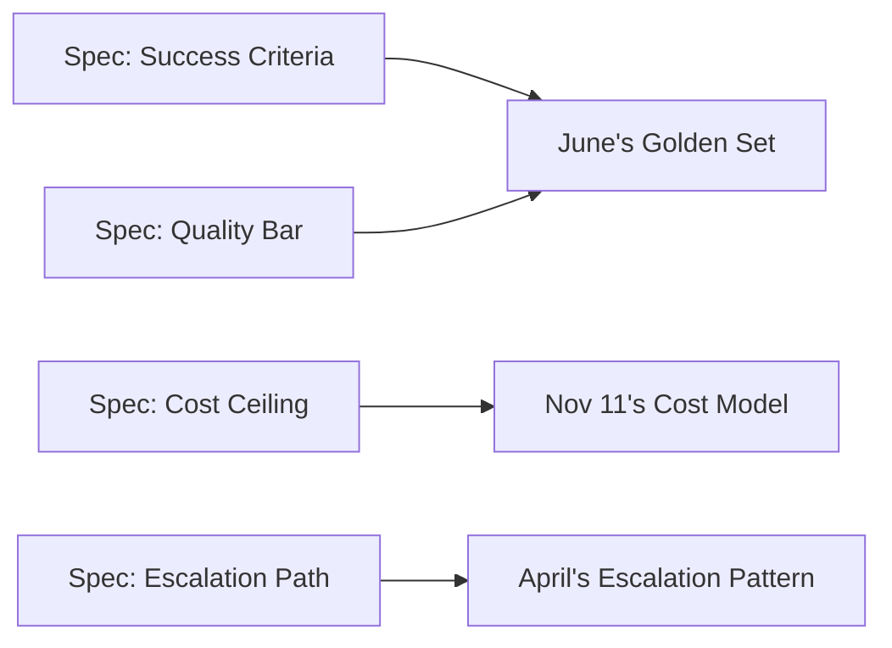

Every technical and business practice this roadmap has covered assumes a spec exists to build against. This post covers what's genuinely different about writing that spec for an AI feature — a traditional deterministic-software spec doesn't transfer cleanly.



Every field in the spec template below maps to a technical practice already covered elsewhere in this roadmap — the product manager's job is making the business decision each field represents, which engineering then implements against using exactly these existing tools.

## Why "It Should Do X" Isn't a Complete Spec for AI Features

A traditional spec can say "clicking submit saves the record" with full confidence it'll happen exactly that way every time. An AI feature spec needs to additionally answer: what does correct behavior look like across the *range* of real inputs, what's an acceptable failure rate, and what should happen when the system is uncertain — questions June's evaluation series exists to answer technically, but that need to be specified at the product level first.

## A Spec Template for AI Features

```python
ai_feature_spec_template = {
    "goal": "the user problem this solves",
    "success_criteria": "measurable, specific — directly maps to June's golden-set criteria",
    "acceptable_failure_modes": "what should happen when the system can't confidently answer (escalate? decline? ask for clarification?)",
    "quality_bar": "minimum acceptable accuracy/quality score, informed by June's evaluation methodology",
    "cost_ceiling": "maximum acceptable cost per interaction, from November 11's cost model",
    "latency_budget": "from June's P95/P99 discipline",
    "escalation_path": "what a human sees and does when the AI defers (April's escalation patterns)",
}
```

Every field here maps to a technical practice already covered elsewhere in this roadmap — the product manager's job is making the *business* decision each field represents (what failure rate is actually acceptable for this specific feature), which the engineering team then implements against.

## Specifying Acceptable Failure Explicitly

```python
failure_mode_spec = {
    "confidently_wrong": "unacceptable — must be minimized via the evaluation gates from June",
    "visibly_uncertain_and_escalates": "acceptable — this is the desired behavior for out-of-scope requests",
    "generic_unhelpful_response": "acceptable as a last resort, worse than escalation but better than confident wrongness",
}
```

This is the product-level articulation of the "visibly wrong beats confidently wrong" principle that's run throughout this roadmap since the agent evaluation posts — a spec that doesn't explicitly rank these failure modes leaves the engineering team guessing at a genuinely important product tradeoff.

## Writing User Stories for Probabilistic Behavior

```markdown
As a support agent user,
When I ask a question outside the system's knowledge base,
I expect the system to say it doesn't know and offer to escalate,
Not to generate a plausible-sounding but unverified answer.

Acceptance criteria: tested against the golden set's "unanswerable questions" slice (July's document AI post pattern),
escalation rate for this category should exceed 90%.
```

Tying acceptance criteria directly to a golden-set slice, rather than a vague qualitative description, is what makes an AI feature spec actually testable against June's evaluation infrastructure rather than requiring subjective judgment calls at ship time.

## Scoping MVP for an AI Feature

```python
def scope_ai_feature_mvp(full_vision: dict) -> dict:
    return {
        "v1_scope": narrow_to_highest_confidence_use_cases(full_vision),
        "explicitly_out_of_scope": list_deferred_capabilities(full_vision),
        "escalation_for_out_of_scope": "route to existing human process, don't attempt and fail silently",
    }
```

A narrower, higher-reliability MVP that explicitly declines out-of-scope requests (routing to an existing process) generally builds more user trust than a broader MVP that attempts everything with inconsistent quality — worth specifying this scoping decision explicitly rather than leaving "how broad should v1 be" as an implicit engineering judgment call.

## Collaborating with Engineering on the Evaluation Bar

The quality bar in the spec (June's golden-set pass rate threshold) should be a genuine collaboration between product and engineering — product brings the business context for what failure rate is actually tolerable for this specific use case, engineering brings the technical reality of what's currently achievable, and the spec should reflect a real negotiation between the two, not a number picked unilaterally by either side.

## Iterating the Spec as Evaluation Data Arrives

```python
def revise_spec_from_production_data(spec: dict, production_metrics: dict) -> dict:
    if production_metrics["escalation_rate"] > spec["expected_escalation_rate"] * 1.5:
        return {"action": "revisit scope — may be attempting cases better handled by escalation from the start"}
```

A spec for a probabilistic system shouldn't be treated as fixed at launch — feeding production evaluation data (June's continuous evaluation) back into spec revisions is a normal, expected part of the product lifecycle for AI features in a way it typically isn't for deterministic ones.

---

*Part of the [Cloud AI Platforms & Business of AI series]({{ site.baseurl }}/tags/cloud-business-series/) — next: [structuring an AI platform team]({{ site.baseurl }}/posts/structuring-ai-platform-team/), the organizational structure that builds against specs like these.*
