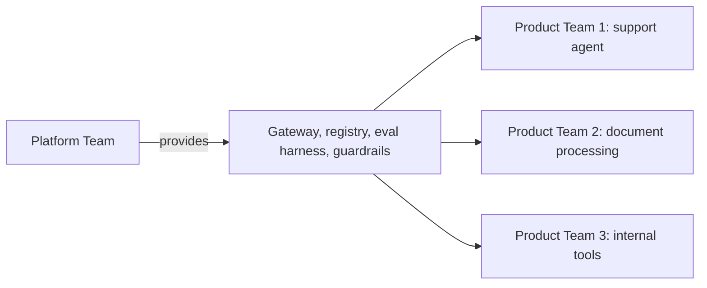

Every piece of shared infrastructure this roadmap has built — the gateway (August), the model registry (August), the evaluation harness (June), the governance process (September) — needs an owning team. This post covers structuring an AI platform team to actually own it well.

## What an AI Platform Team Owns

```python
platform_team_ownership = {
    "shared_infrastructure": "the LLM gateway, model registry, vector store infra (August's series)",
    "evaluation_tooling": "the eval harness and golden dataset tooling teams build on (June's series)",
    "security_and_governance": "guardrail frameworks, red-team suite maintenance, compliance tooling (September's series)",
    "standards_and_best_practices": "the patterns this roadmap has covered, codified into internal guidance",
    "cost_governance": "budget allocation and attribution tooling (August's multi-team posts)",
}
```

The unifying theme: capability that's genuinely shared across multiple product teams, where centralizing ownership avoids the duplicated effort of every team building their own version — directly the same "buy vs build" logic from November 13, applied to internal team structure rather than external vendors.

## Platform Team vs Product Team Split



Product teams own the specific agent behavior, prompts, and business logic for their feature (October's subagent-composition and configuration-versioning posts apply at this layer); the platform team owns the shared infrastructure those product teams build on — a clean division of responsibility that avoids both platform-team bottleneck (if they own too much) and duplicated infrastructure effort (if they own too little).

## Sizing a Platform Team Relative to Product Teams

```python
def estimate_platform_team_size(num_product_teams: int, infra_maturity: str) -> dict:
    ratio = {"early_stage": 1/2, "growing": 1/4, "mature": 1/6}[infra_maturity]  # platform:product team ratio
    return {"recommended_platform_engineers": max(2, int(num_product_teams * ratio))}
```

Early on, when shared infrastructure is still being built from scratch, a platform team needs relatively more people per product team it serves; as infrastructure matures and self-service tooling reduces the platform team's per-request involvement, that ratio should shrink — a platform team that doesn't get more efficient over time as infrastructure matures is a warning sign worth investigating.

## Avoiding the Platform-as-Bottleneck Failure Mode

```python
platform_team_antipatterns = {
    "gatekeeping_every_deploy": "every model or prompt change requires platform team approval — creates a bottleneck",
    "no_self_service": "product teams can't provision their own resources within policy — forces unnecessary platform team involvement",
    "unclear_ownership_boundary": "ambiguity about who owns what leads to either duplication or gaps",
}
```

The healthiest platform teams build self-service tooling with policy guardrails built in (the tiered review process from September's governance post, where only high-risk changes need platform/committee involvement) rather than manually gatekeeping every change — the goal is enabling product teams to move fast within safe boundaries, not funneling every decision through a central team.

## Platform Team Success Metrics

```python
platform_team_kpis = {
    "product_team_time_to_ship": "how quickly can a new product team stand up a new AI feature using platform tooling",
    "infrastructure_reliability": "August's uptime/incident metrics for shared infra",
    "adoption_rate": "what fraction of product teams use platform tooling vs building their own",
    "cost_efficiency": "August's cost-attribution metrics, aggregated across the org",
}
```

Measuring the platform team on outcomes for the teams it serves (time-to-ship, adoption) rather than purely internal metrics (lines of code shipped, features built) keeps its incentives aligned with actually being useful infrastructure, not building impressive-looking but under-adopted tooling.

## When Not to Have a Dedicated Platform Team Yet

For a small organization with one or two product teams building AI features, a dedicated platform team is premature — the coordination overhead of a separate team outweighs the benefit until there's genuine duplication of effort across multiple product teams to justify centralizing. A single senior engineer wearing a part-time "platform" hat, gradually formalizing into a dedicated team as the organization scales, is the more common and appropriate trajectory.

---

*Part of the [Cloud AI Platforms & Business of AI series]({{ site.baseurl }}/tags/cloud-business-series/) — next: [AI Engineer vs ML Engineer vs Data Scientist]({{ site.baseurl }}/posts/ai-engineer-ml-engineer-data-scientist-teams/), the role composition within and around this team structure.*
