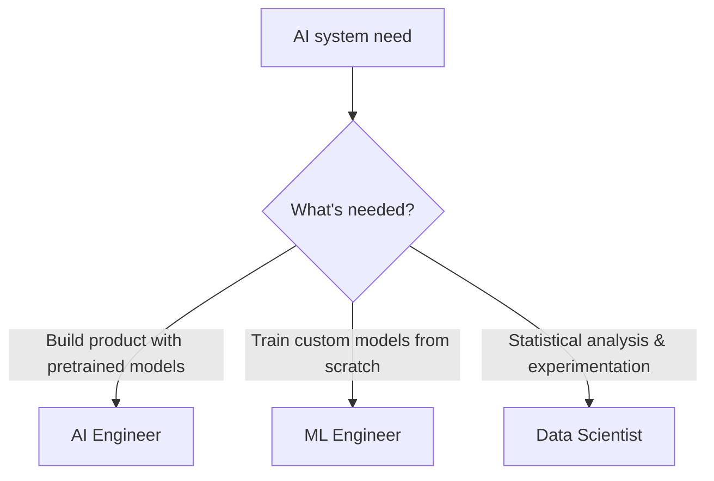

March's first post in this entire roadmap drew the AI Engineer vs ML Engineer distinction conceptually. This post revisits it at the team-composition level — who you actually need, in what mix, to build and run everything this roadmap has covered.



The distinction that matters day to day is what each role actually builds, not a job title — since essentially all of March through October is AI engineering work by this definition, most teams building on this roadmap end up AI-engineer-heavy, as the team composition example below shows concretely.

## The Three Roles, Distinguished by What They Actually Do Day to Day

```python
role_comparison = {
    "ai_engineer": {"builds": "products using pre-trained models via APIs/fine-tuning", "core_skills": "software engineering + prompt/agent design",
                     "roadmap_coverage": "essentially all of March-October"},
    "ml_engineer": {"builds": "custom models from scratch, training infrastructure", "core_skills": "deep ML theory + distributed training",
                     "roadmap_coverage": "adjacent to May's fine-tuning series, but for from-scratch training rather than adapting pretrained models"},
    "data_scientist": {"builds": "analysis, experimentation, statistical insight", "core_skills": "statistics + domain analysis",
                       "roadmap_coverage": "overlaps with June's statistical significance and evaluation methodology"},
}
```

## Why Most Teams Building on This Roadmap Are AI-Engineer-Heavy

Everything from March through October — agents, RAG, fine-tuning pretrained models via LoRA, evaluation, infrastructure — is AI engineering work as defined above, not from-scratch ML research. A team building the kinds of systems this roadmap covers is typically majority AI engineers, with ML engineering expertise needed more narrowly (if a genuine from-scratch training need arises) and data science expertise valuable for the statistical rigor behind June's evaluation practices.

## A Practical Team Composition for a Mid-Sized AI Product Team

```python
example_team_composition = {
    "ai_engineers": 4,       # building agents, RAG, integrations — the bulk of the roadmap's content
    "ml_engineer": 1,        # for the occasional genuine fine-tuning/training infrastructure need
    "data_scientist": 0.5,   # part-time, supporting evaluation methodology and experiment design
    "platform_engineer": 1,  # yesterday's platform team role
    "product_manager": 1,    # November 16's spec-writing role
}
```

This ratio isn't universal — a team building genuinely novel model architectures needs far more ML engineering depth; a team purely doing prompt-engineering-light integration work might not need a dedicated ML engineer at all. The point is that the roles aren't interchangeable, and hiring a strong ML researcher for what's actually an AI engineering role (or vice versa) is a common, costly mismatch.

## Skills Overlap and Where Roles Blend

```python
overlapping_skills = {
    "evaluation_methodology": "all three roles benefit from June's evaluation rigor, with different emphasis",
    "python_proficiency": "shared baseline across all three",
    "production_engineering": "AI engineers and platform engineers need this most; less central for a pure ML engineer or data scientist role",
}
```

In smaller organizations, one person often blends aspects of all three roles — the distinction matters most for hiring and for understanding where a specific skill gap actually is, not as a rigid organizational chart every team needs to replicate exactly.

## Career Paths Between the Roles

```python
common_transitions = {
    "software_engineer_to_ai_engineer": "the most common path — this roadmap's intended audience, per March's opening post",
    "data_scientist_to_ai_engineer": "brings strong evaluation instincts, needs to build production software engineering skill",
    "ml_engineer_to_ai_engineer": "brings deep model understanding, needs to shift focus from training to integration/product",
}
```

Understanding these transition paths matters for both individual career planning (this roadmap's original framing) and for team-building — recognizing that a strong data scientist or ML engineer can grow into an AI engineering role with the right support, rather than treating hiring as the only path to filling a skill gap.

## Interviewing for AI Engineering Specifically

```python
ai_engineer_interview_focus = {
    "system_design_for_probabilistic_systems": "November 16's spec-writing skill, tested in an interview setting",
    "practical_prompt_and_agent_design": "hands-on evaluation of the skills from March-April's series",
    "evaluation_thinking": "does the candidate reflexively ask 'how would we measure this' (June's core habit)",
    "production_engineering_fundamentals": "standard software engineering competence, still essential per March's original framing",
}
```

An interview loop that only tests ML theory will systematically miss strong AI engineering candidates whose actual value is in the intersection of software engineering and model integration — calibrate interview design to what the role actually does day to day, not to a generic "AI/ML" interview template borrowed from a different role's needs.

---

*Part of the [Cloud AI Platforms & Business of AI series]({{ site.baseurl }}/tags/cloud-business-series/) — next: [onboarding engineers into an existing AI codebase]({{ site.baseurl }}/posts/onboarding-engineers-ai-codebase/), once the team is hired.*
