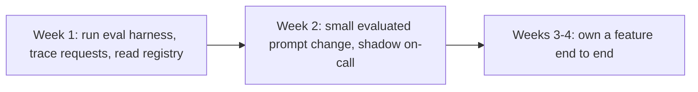

Yesterday's post covered hiring the right mix of roles. This post covers what happens next — getting a new engineer, of any of those three types, productive in an existing AI codebase, which has onboarding challenges a typical software codebase doesn't.



Starting with reading traces and running evaluations, not writing code, is the deliberate ordering here — it gives a new engineer an evidence-based understanding of system behavior faster than reading prompt text alone ever could.

## Why AI Codebases Are Harder to Onboard Into

A new engineer joining a traditional codebase can usually run the test suite, read through deterministic code paths, and build a mental model through debugging. An AI codebase adds layers that don't work that way — prompts whose behavior isn't obvious from reading the text alone, evaluation infrastructure that requires understanding what "good" means for a specific feature, and agent orchestration logic where behavior emerges from an interaction between code and model rather than code alone.

## A Structured Onboarding Path

```python
onboarding_checklist = {
    "week_1": [
        "run the eval harness against the golden set locally (June's series) — see what 'quality' means concretely",
        "trace a single request through the system using June's observability tooling",
        "read the model registry (August) to understand what's actually deployed and why",
    ],
    "week_2": [
        "make a small, evaluated prompt change and watch it go through the CI regression gate",
        "shadow an on-call rotation or review a past incident postmortem (June's template)",
    ],
    "week_3_4": [
        "own a small feature end to end, from spec (November 16) through evaluation to deployment",
    ],
}
```

Starting with *reading traces and running evaluations* before writing any code gives a new engineer a concrete, evidence-based understanding of system behavior — much faster than trying to build a mental model purely by reading prompt text, which often doesn't reveal how a prompt actually behaves across the input distribution.

## Documentation a New Engineer Actually Needs

```python
essential_onboarding_docs = {
    "architecture_overview": "the reference architecture pattern from August's closing post, specific to your system",
    "eval_methodology": "what the golden set covers, what the quality bar means, how to run it locally",
    "runbook_for_common_incidents": "June's postmortem-derived runbooks",
    "prompt_and_config_versioning_process": "October 27's practice, documented for this specific codebase",
    "who_owns_what": "the platform vs product team boundary from yesterday's post",
}
```

Tomorrow's post covers documentation practices for AI systems generally — this onboarding-specific subset is the highest-priority slice to have genuinely current and accurate, since a new engineer following stale documentation in an AI system can introduce subtle, hard-to-catch regressions faster than in a more conventional codebase.

## Pairing on Evaluation, Not Just Code Review

```python
def onboarding_pairing_focus(new_engineer_pr: dict) -> list[str]:
    focus_areas = ["does this change include updated eval cases?", "were the CI regression gate results reviewed, not just the diff?"]
    if new_engineer_pr.get("touches_tools"):
        focus_areas.append("was least-privilege scoping considered? (September's principle)")
    return focus_areas
```

Code review for AI features needs a distinct checklist beyond standard code quality — a technically clean diff that skips evaluation consideration or introduces an overprivileged tool is a real risk a standard code review checklist wouldn't catch, worth making explicit for reviewers pairing with a new team member.

## Common Onboarding Pitfalls Specific to AI Codebases

```python
onboarding_pitfalls = {
    "treating_prompts_like_regular_strings": "not understanding that a prompt change needs the same rigor as any other behavior change",
    "skipping_the_eval_step": "shipping a change that 'looks right' without running it against the golden set",
    "underestimating_cost_impact": "not realizing a seemingly small change (e.g. model choice) has real cost implications (August's series)",
}
```

Naming these pitfalls explicitly during onboarding — rather than letting a new engineer discover them the hard way — accelerates genuine productivity and prevents the kind of subtle quality or cost regression that's much more expensive to catch after the fact than to prevent through good onboarding.

## Measuring Onboarding Effectiveness

```python
def onboarding_success_metrics(new_engineer: dict) -> dict:
    return {
        "time_to_first_merged_pr": measure_days(new_engineer, "first_pr"),
        "time_to_first_pr_without_eval_gaps_flagged": measure_days(new_engineer, "first_clean_pr"),
        "time_to_own_incident_response": measure_days(new_engineer, "first_oncall_shift"),
    }
```

Tracking these metrics across new hires surfaces whether the onboarding process itself needs improvement — a consistently long time-to-first-clean-PR across multiple new engineers points at a documentation or process gap worth fixing at the source, not an individual competence issue.

---

*Part of the [Cloud AI Platforms & Business of AI series]({{ site.baseurl }}/tags/cloud-business-series/) — next: [documentation practices for AI systems]({{ site.baseurl }}/posts/documentation-practices-ai-systems/), the artifact this onboarding process depends on.*
