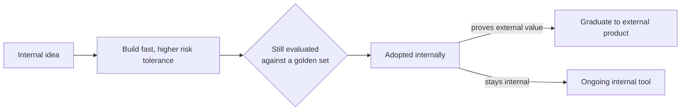

Every principle this month has assumed an external, customer-facing product. Internal AI tools — built for your own colleagues — have a genuinely different risk/reward profile worth treating distinctly, both as a lower-stakes place to build AI engineering muscle and as real, valuable products in their own right.



The lower-stakes path still runs through real evaluation — it just skips straight to adoption unless a tool proves it deserves the full external-facing bar. This is the loop this section and the next two walk through in detail.

## Why Internal Tools Are a Good Starting Point

```python
internal_vs_external_tradeoffs = {
    "risk_tolerance": "generally higher — a mistake affects a colleague, not a paying customer or the brand",
    "feedback_loop_speed": "much faster — your users sit near you, feedback is immediate and rich",
    "iteration_freedom": "can ship rougher, iterate faster, without the same reputational stakes",
    "compliance_scope": "often (not always) narrower — but September's PII/access-control practices still fully apply for sensitive internal data",
}
```

This lower-stakes profile makes internal tools a natural place for a team to build genuine AI engineering muscle — practicing the evaluation, guardrail, and deployment discipline from this entire roadmap on a forgiving audience before applying the same rigor to a customer-facing launch.

## Common High-Value Internal Tool Categories

```python
internal_tool_categories = {
    "internal_search_and_qa": "RAG over internal docs, wikis, past decisions (March's series) — often the highest-ROI first internal tool",
    "code_review_assistance": "November 27's case study",
    "support_ticket_triage": "internal IT/HR ticket routing, a lower-stakes version of November 26's case study",
    "meeting_notes_and_summarization": "July's meeting notes app, applied internally",
    "onboarding_assistants": "helping new hires navigate internal systems and documentation",
}
```

## Don't Skip Evaluation Just Because Stakes Are Lower

```python
internal_tool_eval_discipline = {
    "still_needed": "a golden set (June's series), even a small one — 'it seems to work' isn't a substitute",
    "can_be_lighter_weight": "less exhaustive red-teaming (September) than a customer-facing launch might warrant",
    "still_needs_guardrails": "internal tools touching sensitive HR/legal/financial data need full September-level rigor regardless of external-facing risk",
}
```

The temptation to skip evaluation rigor for "just an internal tool" is a common and costly mistake — an internal tool that gives confidently wrong HR policy guidance or leaks compensation data across teams (a real access-control failure, per September's least-privilege principle) causes genuine organizational harm despite never facing an external customer.

## Measuring Internal Tool Success

```python
internal_tool_metrics = {
    "adoption_and_sustained_usage": "November 21-22's principles apply directly, with colleagues as the user base",
    "time_saved": "directly measurable via November 15's ROI framework, often easier to instrument than external revenue impact",
    "colleague_satisfaction": "internal NPS-style feedback, a lower-friction version of external user research",
}
```

Internal tools often have the cleanest ROI story in the whole organization — direct access to before/after time measurements without the confounding factors (marketing, seasonality, competitive dynamics) that complicate external revenue attribution, making November 15's ROI framework easiest to apply rigorously here first.

## Internal Tools as a Platform Team Proving Ground

August's infrastructure and this month's platform-team posts describe shared infrastructure meant to serve multiple product teams — internal AI tools are a natural first consumer of that infrastructure, letting a platform team validate their gateway, evaluation harness, and governance process on a forgiving internal audience before external product teams depend on the same infrastructure for customer-facing launches.

## When Internal Tools Graduate to External Products

```python
def graduation_readiness_check(internal_tool: dict) -> dict:
    return {
        "eval_rigor_matches_external_bar": internal_tool["golden_set_size"] >= EXTERNAL_MINIMUM,
        "red_team_coverage_complete": internal_tool["red_team_suite_run"],  # September's full checklist
        "governance_review_completed": internal_tool["governance_approved"],  # September's committee process
    }
```

A successful internal tool sometimes reveals genuine external product potential — but graduating it requires deliberately raising the bar to the full external-facing rigor this roadmap has covered throughout, not assuming internal success automatically transfers to external readiness.

---

*Part of the [Cloud AI Platforms & Business of AI series]({{ site.baseurl }}/tags/cloud-business-series/) — next, four case studies applying this whole roadmap concretely, starting with [migrating a legacy search feature to RAG]({{ site.baseurl }}/posts/case-study-legacy-search-to-rag/).*
