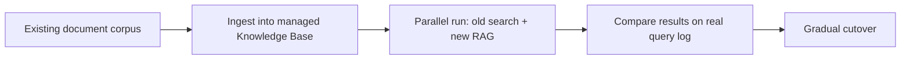

The next four posts are worked case studies, walking a realistic project end to end using this entire roadmap's techniques in sequence. First: migrating a traditional keyword-search feature to a RAG-based system — a common, concrete modernization project.

## The Starting Point and the Business Case

A legacy internal documentation search using basic keyword matching (Elasticsearch, no semantic understanding) frequently returns irrelevant results for natural-language queries — "how do I get reimbursed for travel" fails to match a document titled "Expense Policy" despite being exactly what the user needs. The business case (November 15's ROI framework): reduced support tickets asking questions the docs already answer, faster employee self-service.

## Phase 1: Scoping and Build-vs-Buy Decision

```python
migration_decision = {
    "capability": "semantic document search",
    "is_core_differentiator": False,  # this is infrastructure, not a competitive advantage
    "decision": "buy managed RAG (November 2's Bedrock Knowledge Base) rather than build from scratch",
    "rationale": "internal tool (Nov 24), team wants to move fast, retrieval quality bar is 'good enough', not maximal",
}
```

Following November 13's build-vs-buy framework directly — this is exactly the kind of undifferentiated infrastructure capability that favors buying a managed solution over the full custom pipeline from March's series.

## Phase 2: Migration Architecture



Running the old and new systems in parallel against real historical queries — the shadow-testing pattern from June, applied to an infrastructure migration rather than a prompt change — surfaces regressions before any user sees the new system.

## Phase 3: Building the Golden Set from Real Usage

```python
def build_migration_golden_set(historical_search_logs: list[dict]) -> list[dict]:
    zero_result_queries = [q for q in historical_search_logs if q["result_count"] == 0]  # old system's known failures
    high_engagement_queries = [q for q in historical_search_logs if q["click_through"] > 0]  # old system's known successes
    return [build_golden_example(q) for q in zero_result_queries + high_engagement_queries]
```

The old system's failure log (queries that returned nothing) is a uniquely valuable golden set source — these are exactly the cases the new RAG system needs to demonstrably fix, following June's "real production failures" golden-set-sourcing principle directly.

## Phase 4: Evaluation Against Both Systems

```python
def compare_search_quality(golden_set: list[dict], old_system, new_system) -> dict:
    old_results = [evaluate_search_relevance(old_system.search(ex["query"]), ex) for ex in golden_set]
    new_results = [evaluate_search_relevance(new_system.search(ex["query"]), ex) for ex in golden_set]
    return {"old_avg_relevance": mean(old_results), "new_avg_relevance": mean(new_results)}
```

## Phase 5: Rollout

```python
rollout_plan = {
    "week_1": "internal dogfooding within the platform team (Nov 21's phased rollout)",
    "week_2_3": "opt-in beta banner on the search page, explicit 'try our new search' framing",
    "week_4_6": "default-on with an easy link back to the old search results",
    "week_8": "full cutover, old system deprecated (following August's zero-downtime and deprecation discipline)",
}
```

## Phase 6: Post-Launch Monitoring

```python
post_launch_metrics = {
    "zero_result_rate": "should drop significantly — the primary quality signal for this specific migration",
    "click_through_rate": "should improve or hold steady, not regress",
    "support_ticket_volume": "the actual business metric from the original ROI case, measured 60-90 days out",
}
```

## What This Case Study Demonstrates

The whole roadmap in miniature: a build-vs-buy decision grounded in the November framework, a real-data-driven golden set (June), shadow testing before rollout (June/August), a phased user-facing rollout (November 21), and post-launch measurement tied back to the original business case (November 15) — no single technique in isolation, but the combination that makes a migration like this actually succeed rather than just technically ship.

---

*Part of the [Cloud AI Platforms & Business of AI series]({{ site.baseurl }}/tags/cloud-business-series/) — next: [Case Study: automating support tickets with agents]({{ site.baseurl }}/posts/case-study-automating-support-tickets-agents/).*
