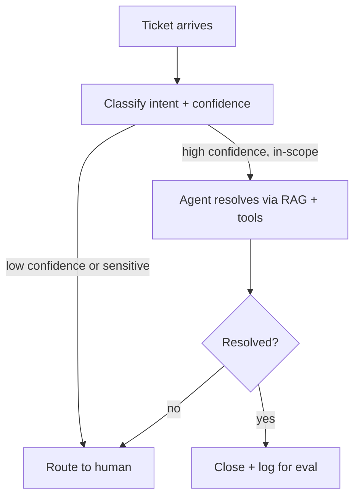

The second case study: building on April's customer support agent tutorial, this walks the full business and organizational lifecycle of taking that pattern from prototype to a production feature handling real customer tickets.

## The Business Case

```python
business_case = {
    "current_state": "support team handles 2,000 tickets/month, avg 12 minutes per ticket, backlog growing",
    "target": "auto-resolve 40% of tickets (well-defined categories: order status, returns, account questions)",
    "roi_estimate": "November 15's framework — labor savings against inference + engineering + review cost",
}
```

## Architecture, Building on April's Foundation



This is April's escalation-gated architecture directly, now with the organizational scaffolding around it: a golden set built from real historical tickets (June), a red-team suite for the specific risks of a support agent with account-modification tools (September), and cost/ROI tracking (November).

## Phase 1: Scoping to a Narrow, High-Confidence Slice

```python
v1_scope = {
    "in_scope_categories": ["order_status", "return_eligibility_check"],  # deliberately narrow
    "explicitly_out_of_scope": ["billing_disputes", "account_security", "anything_with_stated_anger"],
    "escalation_default": "when uncertain, always escalate — never guess on a narrow v1",
}
```

Directly implementing November 16's MVP-scoping principle — starting narrow with categories the golden set shows high confidence on, rather than attempting the full ticket taxonomy from day one and accepting a higher failure rate across the board.

## Phase 2: Building the Evaluation and Security Foundation

```python
pre_launch_checklist = {
    "golden_set": "500 real historical tickets across in-scope categories, following June's sourcing discipline",
    "red_team_suite": "prompt injection via ticket content, exfiltration risk audit for account-data tools (September)",
    "least_privilege_tools": "the agent's refund tool caps at a specific dollar amount, requiring human approval above it",
}
```

## Phase 3: Shadow Testing Against Real Ticket Volume

```python
shadow_results = evaluate_shadow_test(
    production_tickets=last_30_days_tickets,
    agent=support_agent_v1,
    comparison="what would a human agent have done",
)
```

Following June's shadow-testing pattern — running the agent against real incoming tickets without it actually responding, comparing its would-be resolution against what the human agent actually did, before any customer sees agent-generated responses.

## Phase 4: Rollout

```python
rollout_phases = {
    "phase_1": "agent drafts a response, human reviews and sends — builds trust data before any autonomy",
    "phase_2": "agent auto-resolves only the highest-confidence category, with a visible 'AI-assisted' label",
    "phase_3": "expand categories based on phase 2's measured accuracy and trust metrics (November 22)",
}
```

Starting with human-reviewed drafts before any autonomous resolution is a deliberate trust-building phase beyond the standard canary rollout — letting the support team build calibrated confidence in the agent's actual quality before any customer-facing autonomy, addressing the internal change-management dimension from November 21 as much as the technical one.

## Phase 5: Measuring the Real Outcome

```python
outcome_metrics = {
    "auto_resolution_rate": "did it hit the 40% target",
    "customer_satisfaction_on_ai_resolved_tickets": "vs baseline — critical to confirm quality, not just volume",
    "escalation_quality": "when it does escalate, is the handoff packaging (April's pattern) actually useful to the human agent",
    "cost_per_resolved_ticket": "November 11's unit economics, compared against the human-handled baseline",
}
```

## What This Case Study Demonstrates

Nearly every post from March through November contributes a piece: the agent architecture itself (March/April), evaluation and shadow testing (June), security review (September), MVP scoping and rollout strategy (November's product posts), and outcome measurement tied to the original business case (November 15) — the throughline being that no single technique makes a project like this succeed; the discipline of applying all of them together does.

---

*Part of the [Cloud AI Platforms & Business of AI series]({{ site.baseurl }}/tags/cloud-business-series/) — next: [Case Study: an AI code review pipeline]({{ site.baseurl }}/posts/case-study-ai-code-review-pipeline/).*
