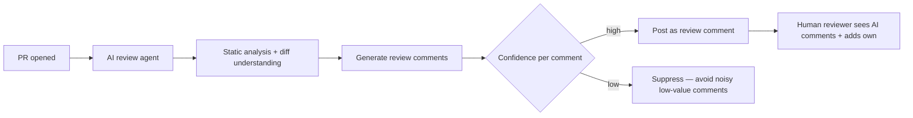

Third case study: an internal AI code review tool, extending April's coding-agent posts into a CI-integrated pipeline that reviews every pull request — a genuinely common, high-value internal tool per November 24's post.

## The Business Case

```python
business_case = {
    "problem": "senior engineers spend significant time on routine review comments (style, obvious bugs, missing tests)",
    "goal": "AI handles the routine first pass, freeing human reviewers for architectural and judgment-heavy feedback",
    "success_metric": "reduction in review turnaround time, without an increase in post-merge defect rate",
}
```

## Architecture



## Why Confidence-Gating Comments Matters More Here Than Elsewhere

```python
def filter_review_comments(comments: list[dict], min_confidence: float = 0.75) -> list[dict]:
    return [c for c in comments if c["confidence"] >= min_confidence]
```

An AI code reviewer that posts many low-value or wrong comments trains engineers to ignore it entirely — worse than not having the tool at all, since it also adds noise to review. This is November 22's trust-asymmetry principle in its sharpest form: a code review tool's credibility, once lost to a few bad comments, is very hard to earn back, making the confidence threshold here deliberately conservative.

## Building the Evaluation Set

```python
def build_code_review_golden_set(historical_prs: list[dict]) -> list[dict]:
    prs_with_real_bugs_caught = [pr for pr in historical_prs if pr["review_caught_a_real_issue"]]
    prs_with_false_positive_review_comments = [pr for pr in historical_prs if pr["review_comment_was_dismissed_as_wrong"]]
    return build_golden_examples(prs_with_real_bugs_caught, prs_with_false_positive_review_comments)
```

Sourcing the golden set from real historical PRs — both cases where human review caught something valuable (what the AI should also catch) and cases where a review comment was later dismissed as incorrect (what the AI must not do) — directly applies June's golden-set-from-real-failures principle to this specific domain.

## Security Considerations Specific to This Tool

```python
security_review_notes = {
    "code_execution_risk": "if the tool runs code to verify behavior, apply September's sandboxing rigor fully",
    "credential_exposure_risk": "PR diffs can contain accidentally-committed secrets — the review tool itself must not log or echo them",
    "supply_chain": "if using an MCP server for repo access, apply September's vetting to that server specifically",
}
```

## Rollout: Starting with Suggestion-Only Mode

```python
rollout_stages = {
    "stage_1": "comments posted as suggestions only, clearly labeled AI-generated, never blocking merge",
    "stage_2": "expand comment categories based on measured precision from stage 1",
    "stage_3": "consider (carefully, with strong evidence) whether specific high-confidence categories could gate merge — most teams stop before this stage",
}
```

Most organizations should stop well short of letting an AI review block a merge — the cost of a false-positive block (blocking legitimate work) is high enough that suggestion-only, human-in-the-loop remains the right end state for this tool category, not just a starting phase, echoing March's guardrails principle about the asymmetric cost of different failure types.

## Measuring Actual Impact, Not Just Usage

```python
impact_metrics = {
    "review_turnaround_time": "the primary business metric from the original case",
    "ai_comment_acceptance_rate": "what fraction of AI comments engineers actually act on — a precision proxy",
    "post_merge_defect_rate": "critically, this should not increase — validates the tool isn't creating false confidence",
}
```

The post-merge defect rate metric is the most important safeguard here — a tool that speeds up review by giving engineers false confidence (skimming human review because "the AI already checked it") would be a net negative even with a great turnaround-time number, exactly the kind of overreliance risk this roadmap's guardrails posts warn against throughout.

## What This Case Study Demonstrates

A tool where the highest-value design decision was restraint — suppressing low-confidence comments, staying suggestion-only, measuring for the specific failure mode (overreliance) the tool could introduce — rather than maximizing automation for its own sake.

---

*Part of the [Cloud AI Platforms & Business of AI series]({{ site.baseurl }}/tags/cloud-business-series/) — next: [Case Study: a voice-driven internal assistant]({{ site.baseurl }}/posts/case-study-voice-driven-internal-assistant/), the final case study.*
