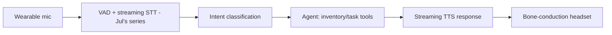

The final case study: a voice-driven internal assistant for warehouse floor staff who need hands-free access to inventory and task information — extending July's voice pipeline series into a full internal product build.

## The Business Case and Why Voice Specifically

```python
business_case = {
    "context": "warehouse staff need inventory lookups and task updates while hands are occupied",
    "why_voice": "the only interaction mode that works without stopping physical work — a genuine ergonomic requirement, not a novelty",
    "success_metric": "reduction in task-switching time, adoption rate among floor staff",
}
```

This is a case where voice isn't chosen for its own sake — it's the only interaction modality that fits the actual physical constraint, an important distinction from choosing voice because it's trendy; July's voice series content only pays off when the modality genuinely fits the use case.

## Architecture, Extending July's Pipeline



## Environment-Specific Challenges Beyond July's Baseline Content

```python
warehouse_specific_challenges = {
    "background_noise": "forklifts, conveyor systems — VAD (July's post) needs retuning against real warehouse audio, not clean office audio",
    "hands_free_confirmation": "voice-only confirmation for actions, no screen to glance at — raises the bar on TTS clarity for critical confirmations",
    "safety_critical_actions": "an incorrect inventory update has real operational cost — needs explicit confirmation loops",
}
```

Retuning VAD and STT against real warehouse audio recordings (not the clean office-environment audio most demos are tuned against) is essential — this is exactly the "measure on your actual data, not generic benchmarks" principle from June, applied to an acoustic environment that meaningfully differs from typical voice-assistant training conditions.

## Guardrails for Voice-Only Confirmation

```python
def confirm_inventory_update(update: dict) -> str:
    return f"Confirming: reduce SKU {update['sku']} by {update['quantity']} units. Say 'confirm' or 'cancel'."
```

Because there's no screen to visually double-check an action before it happens, voice confirmation for any consequential action needs to be unambiguous and explicitly require a clear verbal confirmation — a stricter version of March's guardrails for irreversible actions, since the usual UI-based confirmation pattern isn't available here at all.

## Evaluating in the Real Environment, Not a Lab

```python
def evaluate_in_production_environment(test_scenarios: list[dict], real_warehouse_recordings: bool = True) -> dict:
    if not real_warehouse_recordings:
        raise ValueError("Lab-quiet audio evaluation will not predict real-world accuracy for this use case")
    return run_eval_suite(test_scenarios, warehouse_voice_assistant)
```

This is worth stating explicitly because it's a common mistake — a voice product evaluated only in a quiet office environment will show inflated accuracy relative to its real deployment conditions, and the golden set (June's series) needs to be built from genuinely representative, noisy real-world audio from the start.

## Rollout: Physical Hardware Adds a Dimension Beyond Software Rollout

```python
rollout_considerations = {
    "hardware_pilot": "a small group tests the physical wearable + software together — hardware issues surface separately from software quality issues",
    "training": "hands-on floor training, not documentation alone (November 24's enablement point, more true here than most internal tools)",
    "fallback": "staff need a clear, fast fallback to the existing manual process if the device fails or gives a wrong answer",
}
```

Voice hardware introduces a failure dimension (battery, connectivity, physical durability in a warehouse environment) entirely separate from the software quality this roadmap otherwise focuses on — worth explicit attention in the rollout plan, not assumed away as "just a device."

## What This Case Study Demonstrates

A product where the modality choice itself (voice) was the right call specifically because of a genuine physical constraint, and where the evaluation and rollout discipline from this roadmap needed real adaptation (noisy-environment testing, hardware rollout considerations) rather than a direct copy-paste of a pattern built for a different context — the general principles held, but applying them well required genuine judgment about this specific use case's differences.

## Closing Out the Case Studies

These four case studies — RAG migration, support automation, code review, voice assistant — span build-vs-buy, agents, internal tooling, and multimodal, deliberately touching nearly every major thread from this year-long roadmap, to demonstrate that the value of everything covered comes from combining these techniques deliberately for a specific real problem, not applying any one of them in isolation.

---

*Part of the [Cloud AI Platforms & Business of AI series]({{ site.baseurl }}/tags/cloud-business-series/) — next: [a vendor evaluation checklist for AI tooling]({{ site.baseurl }}/posts/vendor-evaluation-checklist-ai-tooling/), consolidating this month's vendor-decision content.*
