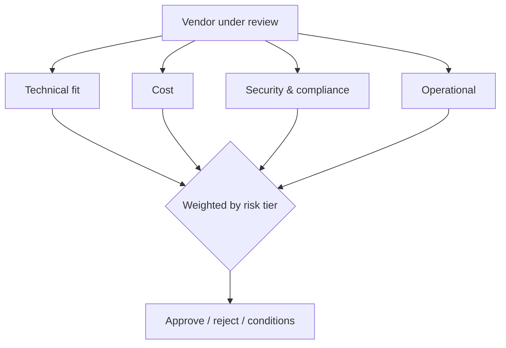

This month has covered vendor decisions piecemeal — cloud platforms, vector databases, contract negotiation, September's risk assessment. This post consolidates it into one practical checklist for evaluating any AI vendor or tool, from a model provider to an evaluation platform to an MCP server.



The five checklist categories all feed one weighted decision, and the weighting itself shifts with risk tier — a low-stakes internal tool weights cost and speed higher, a regulated customer-facing system weights security and compliance higher, as the sections below detail.

## The Full Checklist

```python
vendor_evaluation_checklist = {
    "technical_fit": [
        "does it meet the actual requirement, evaluated empirically on your task (Oct 30's benchmarking methodology)",
        "integration effort and portability cost (Nov 7's lock-in framework)",
        "performance under your actual load pattern, not vendor-published benchmarks",
    ],
    "cost": [
        "full cost model, not just list price (Nov 11's framework)",
        "cost trajectory at your projected scale, not just current volume",
    ],
    "security_and_compliance": [
        "September's vendor risk assessment — data handling, certifications, BAA/DPA availability",
        "supply chain vetting if it's a tool/MCP server, not just a model provider (Sep's supply chain post)",
    ],
    "operational": [
        "SLA terms and what they actually cover (Nov 14's scrutiny)",
        "your fallback plan if this vendor becomes unavailable (Aug's fallback strategies)",
    ],
    "organizational": [
        "does this belong in the platform team's shared infrastructure or a product team's specific stack (Nov 17)",
        "governance approval needed for this risk tier (Sep's governance committee)",
    ],
}
```

## Running the Checklist as an Actual Process

```python
@dataclass
class VendorEvaluation:
    vendor_name: str
    capability: str
    checklist_results: dict
    overall_recommendation: Literal["approve", "approve_with_conditions", "reject", "needs_more_evaluation"]
    reviewed_by: list[str]
    review_date: date
```

Treating this as a documented, repeatable process — not an ad hoc conversation — is what makes vendor decisions consistent across teams and revisitable later (the same "document the decision, not just the outcome" principle from June's postmortems and September's risk assessments).

## Weighting Criteria by What's Actually at Stake

```python
def weight_criteria_by_risk_tier(risk_tier: str) -> dict:
    if risk_tier == "high":
        return {"security_compliance": 0.4, "technical_fit": 0.3, "cost": 0.15, "operational": 0.15}
    return {"technical_fit": 0.4, "cost": 0.3, "operational": 0.2, "security_compliance": 0.1}
```

A vendor evaluation for a low-stakes internal tool (November 24's category) should weight cost and speed-to-value more heavily; one for a high-risk, customer-facing, regulated-data system should weight security and compliance far more heavily — applying September's risk-tiering to the vendor evaluation process itself, not just to the systems built on top of the vendor.

## Red Flags Worth Weighting Heavily

```python
vendor_red_flags = {
    "vague_data_handling_answers": "a vendor that can't clearly answer whether they train on your data is a serious flag",
    "no_meaningful_sla": "for anything business-critical, absence of real commitments is itself informative",
    "resistance_to_security_review": "a legitimate enterprise vendor should expect and accommodate this",
    "pricing_that_doesnt_scale_transparently": "opaque enterprise-only pricing that requires a sales call for basic numbers",
}
```

## Comparing Multiple Vendors Fairly

```python
def compare_vendors(vendors: list[str], checklist: dict) -> dict:
    return {v: run_checklist(v, checklist) for v in vendors}
```

Evaluating every vendor under consideration against the identical checklist — not letting the vendor with the best sales relationship get a lighter review — is what keeps the process defensible, particularly important for anything that will eventually face September's governance committee or an external audit.

## Revisiting Approved Vendors Periodically

```python
def vendor_review_cadence(risk_tier: str) -> int:
    return {"high": 6, "medium": 12, "low": 24}[risk_tier]  # months between re-reviews
```

Directly extending September's periodic vendor risk review — an approved vendor isn't approved forever; terms, security posture, and your own requirements all evolve, and the review cadence should match the risk tier the same way any other governance process in this roadmap does.

## Using This Checklist as a Starting Point, Not a Rigid Template

Every organization's specific priorities differ — a startup optimizing for speed will weight differently than a regulated enterprise optimizing for compliance certainty. The value of a checklist like this is ensuring nothing important gets silently skipped under time pressure, not enforcing a rigid, one-size-fits-all process.

---

*Part of the [Cloud AI Platforms & Business of AI series]({{ site.baseurl }}/tags/cloud-business-series/) — closing tomorrow with [the business case for investing in AI observability]({{ site.baseurl }}/posts/business-case-ai-observability-investment/).*
