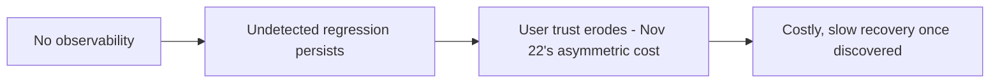

This closes out November by making the business case explicit for the technical investment June's entire evaluation and observability series described — connecting engineering practice to the ROI language this month has built throughout.

## Why Observability Investment Is a Hard Sell Without This Framing

Observability infrastructure (June's series) doesn't ship a visible feature — it's easy to deprioritize against feature work that has a more obvious, immediate business story. This post makes the case in the same ROI terms November 15 established for any other initiative.

## The Cost of Not Investing

```python
cost_of_no_observability = {
    "undetected_quality_regressions": "a silent drift (June's drift-detection post) erodes user trust for weeks before anyone notices",
    "slow_incident_response": "without traces (June's post), diagnosing a production issue takes hours instead of minutes",
    "compliance_exposure": "no audit trail (September's series) means real risk during a regulatory inquiry",
    "wasted_spend": "no cost attribution (August's series) means inefficient spend goes uncorrected indefinitely",
}
```



The cost of under-investing in observability isn't a one-time missed feature — it compounds, since November 22's trust-asymmetry means a regression caught late costs far more in trust damage than the same regression caught immediately via good monitoring.

## Quantifying the Value of Observability Investment

```python
def estimate_observability_roi(incident_history: dict, observability_investment_cost: float) -> dict:
    mttr_without = incident_history["avg_time_to_detect_and_resolve_without_tracing"]
    mttr_with = incident_history["avg_time_to_detect_and_resolve_with_tracing"]
    incidents_per_year = incident_history["annual_incident_count"]
    time_saved_value = (mttr_without - mttr_with) * incidents_per_year * INCIDENT_COST_PER_HOUR
    return {"annual_value": time_saved_value, "investment_cost": observability_investment_cost,
            "roi_pct": (time_saved_value - observability_investment_cost) / observability_investment_cost * 100}
```

Mean-time-to-resolution improvement is the most directly quantifiable observability benefit — comparing incident response speed with and without the tracing/dashboard infrastructure from June gives a concrete, defensible number for a budget conversation, following exactly November 15's ROI-measurement discipline.

## The Harder-to-Quantify but Real Value

```python
harder_to_quantify_value = {
    "prevented_incidents": "regressions caught by continuous evaluation (June) before reaching production — counterfactual, hard to prove precisely",
    "faster_iteration": "engineers trust changes more when eval gates exist, shipping with more confidence and speed",
    "compliance_and_audit_readiness": "September's posts — the cost of NOT having this only becomes visible during an actual audit",
}
```

Being honest that some value here is genuinely hard to quantify precisely (following November 15's caution about strategic value) — but "hard to quantify precisely" isn't the same as "not real," and a credible business case can include these as qualitative factors alongside the harder MTTR numbers.

## Presenting This Case to Non-Engineering Stakeholders

```python
def observability_investment_pitch(quantified_roi: dict) -> str:
    return f"""
    Investment: {quantified_roi['investment_cost']}
    Estimated annual value from faster incident resolution alone: {quantified_roi['annual_value']}
    Additional risk mitigation: compliance readiness, prevented regressions (qualitative, see attached)
    """
```

Leading with the quantified number, then supporting it with the qualitative risk-mitigation case, mirrors November 15's audience-appropriate reporting principle — a purely qualitative pitch ("trust us, this matters") is a much harder sell than one grounded in a concrete, defensible calculation, however partial.

## What a Reasonable Observability Investment Looks Like at Different Stages

```python
observability_investment_by_stage = {
    "early_stage": "June's minimal viable stack — structured logging, a small golden set, basic dashboard",
    "growth_stage": "full CI regression gates, production sampling, drift detection",
    "mature": "the complete reference stack from June's closing post, integrated with September's governance",
}
```

This mirrors June's own "minimal viable version" closing guidance — the business case for observability investment should scale with organizational maturity and stakes, not assume every team needs the full stack from day one, the same proportionate-investment principle that's run through this entire roadmap's approach to engineering rigor.

## Closing November

This month moved from infrastructure-you-can-touch (cloud platforms) to the business, organizational, and human layer that makes AI engineering work sustainable at a company level — cost, pricing, teams, trust, and real case studies tying the whole roadmap together. December closes the entire year-long series with career development, capstone projects, and a look back at everything covered since March.

---

*Part of the [Cloud AI Platforms & Business of AI series]({{ site.baseurl }}/tags/cloud-business-series/) — the final post in this series, leading into [Career, Capstones & Roadmap Wrap-Up]({{ site.baseurl }}/tags/career-series/) starting tomorrow.*
