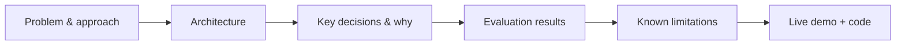

Nine months of this roadmap have built real technical depth. December turns that into career outcomes — starting with the portfolio that gets you in the door, before the capstone projects later this month give you the concrete things to put in it.



This is the project write-up structure the rest of this post argues for — each stage matters, but the evaluation and known-limitations stages are the ones a generic tutorial-follower's portfolio usually skips.

## What an AI Engineering Portfolio Needs That a General SWE Portfolio Doesn't

```python
portfolio_differentiators = {
    "evaluation_artifacts": "not just 'I built a RAG chatbot' — show the golden set and eval results (June's series)",
    "production_thinking": "guardrails, cost awareness, failure handling — not just a happy-path demo",
    "real_tradeoff_decisions": "documented reasoning for model choice, architecture choice — shows judgment, not just execution",
}
```

A portfolio that only shows "it works" undersells everything this roadmap taught beyond the initial build — an interviewer evaluating AI engineering specifically wants to see evidence of the evaluation, safety, and cost-awareness instincts that distinguish a production-ready engineer from someone who followed a tutorial.

## Structuring a Project Write-Up

```markdown
## Project: [Name]
### Problem and approach
### Architecture (diagram)
### Key technical decisions and why (e.g. "chose RAG over fine-tuning because...")
### Evaluation methodology and results (golden set size, metrics, scores)
### What I'd do differently / known limitations
### Live demo + code link
```

The "known limitations" section is worth including deliberately — it demonstrates the calibrated honesty this entire roadmap has emphasized (visibly uncertain beats confidently wrong), and it signals to an interviewer that you understand your own system's boundaries rather than overselling it.

## Choosing Which Projects to Feature

```python
def select_portfolio_projects(candidate_projects: list[dict], target_roles: list[str]) -> list[dict]:
    scored = [(p, relevance_to_roles(p, target_roles) * demonstrates_range(p, candidate_projects)) for p in candidate_projects]
    return [p for p, score in sorted(scored, key=lambda x: -x[1])[:3]]
```

Three strong, well-documented projects that collectively demonstrate range (a RAG system, an agent, something touching infrastructure or evaluation) beat six shallow ones — this month's capstone projects are deliberately designed to give you exactly this kind of range to choose from.

## Making the Code Itself Interview-Ready

```python
code_quality_signals_for_review = {
    "clear_commit_history": "shows how you actually work, not just a final squashed commit",
    "tests_including_eval_tests": "June's evaluation-as-testing pattern, visible in the actual test suite",
    "readme_that_respects_the_readers_time": "a reviewer skims — lead with what it does and why, not setup instructions",
}
```

## Demonstrating Judgment, Not Just Completion

```python
judgment_demonstration_examples = {
    "documented_a_rejected_approach": "e.g. 'considered fine-tuning, chose RAG because the knowledge changes frequently' (May's decision framework)",
    "included_a_cost_analysis": "even a simple one — shows November's cost-awareness applied to a personal project",
    "addressed_a_security_consideration": "even briefly — shows September's habits weren't just for this roadmap's sake",
}
```

Interviewers see many portfolios that demonstrate the ability to follow a tutorial and few that demonstrate the ability to make and explain a real engineering tradeoff — the latter is what actually predicts strong on-the-job performance, and it's a deliberate signal worth making visible rather than assuming it'll be inferred.

## Keeping the Portfolio Current

```python
def portfolio_freshness_check(projects: list[dict]) -> list[str]:
    return [p["name"] for p in projects if uses_deprecated_patterns(p) or (now() - p["last_updated"]).days > 365]
```

A portfolio showcasing a two-year-old approach to a fast-moving field signals staleness — periodically revisiting and updating featured projects (even lightly, swapping a deprecated model reference or an outdated framework version) keeps the portfolio's signal accurate.

## Where the Portfolio Fits in the Job Search

The portfolio's job is to earn a conversation, not to fully prove competence on its own — it should be strong enough to get an interview where the deeper technical conversation (tomorrow's system-design interview post) can actually happen.

---

*Part of the [Career series]({{ site.baseurl }}/tags/career-series/) — following November's [Cloud AI Platforms & Business of AI series]({{ site.baseurl }}/tags/cloud-business-series/).*
