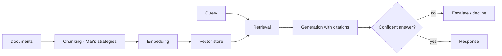

Yesterday's post covered the interview format generally. This post walks a complete worked answer to "design a RAG system for our internal documentation," the way a strong candidate would actually work through it on a whiteboard.

## Step 1: Clarifying Questions First

```python
clarifying_questions = [
    "How large and how frequently updated is the document corpus?",  # informs chunking/indexing strategy, Mar's series
    "What's the acceptable latency?",  # informs architecture choices, Jun's latency posts
    "What happens when there's no good answer in the docs?",  # informs guardrail design, Mar's principles
    "Who are the users, and what's the cost of a wrong answer?",  # informs the whole risk posture
]
```

Asking these before drawing anything signals the product-thinking instinct interviewers are evaluating — a candidate who jumps straight to architecture without this step misses the chance to show they'd actually make good decisions with real requirements, not just technique knowledge.

## Step 2: The Architecture Diagram



Drawing this incrementally, narrating each decision ("I'll use semantic chunking here because... I'd consider hybrid search because...") demonstrates the reasoning process, not just the final diagram — interviewers weight the narration heavily since it's what reveals actual understanding versus memorized architecture.

## Step 3: Addressing the Interviewer's Likely Follow-Ups

```python
anticipated_follow_ups = {
    "how_do_you_evaluate_this": "golden set construction (Jun), RAGAS-style faithfulness/relevancy metrics (Mar)",
    "how_do_you_handle_stale_documents": "incremental indexing, freshness checks (Mar/Aug's RAG-at-scale post)",
    "what_if_the_corpus_grows_to_millions_of_docs": "ANN indexing, sharding (Aug's scaling post)",
    "how_do_you_prevent_hallucination": "faithfulness checking, explicit 'I don't know' training (Jun's factuality post)",
}
```

Having these ready — not memorized verbatim, but genuinely understood well enough to explain concisely — is what this whole roadmap's RAG-related content (March, June, August) was building toward being able to do fluently under interview pressure.

## Step 4: Discussing the Build-vs-Buy Angle

```python
def address_build_vs_buy_in_interview() -> str:
    return ("For a v1, I'd lean toward a managed solution like Bedrock Knowledge Bases (Nov's series) "
            "to move fast, and evaluate whether retrieval quality justifies a custom pipeline once we "
            "have real usage data to inform that decision.")
```

Mentioning this tradeoff explicitly — even briefly — signals awareness of November's business-layer content, showing the candidate thinks beyond pure technical architecture into practical delivery tradeoffs, a meaningfully senior-level signal.

## Step 5: A Concise Closing Summary

```python
closing_summary_template = """
To summarize: I'd build a standard chunk-embed-retrieve-generate pipeline, starting with a managed
service for speed, with an explicit evaluation harness against a golden set from real queries,
citation-based faithfulness checking, and a clear escalation path for low-confidence answers.
I'd watch retrieval quality and cost as the two signals that would tell us whether to invest in
a more custom pipeline.
"""
```

Ending with a tight summary — even when time is short — leaves the interviewer with a clean, memorable takeaway of the design rather than trailing off mid-detail, which matters disproportionately for how the interview gets evaluated afterward in a debrief.

## What Separates a Strong Answer From a Merely Correct One

A technically correct architecture that's recited without the reasoning, the clarifying questions, or the evaluation-mindedness this roadmap has emphasized throughout will read as "knows the technique" rather than "would build this well in production" — the gap between those two is exactly what a senior-level interview is designed to surface.

---

*Part of the [Career series]({{ site.baseurl }}/tags/career-series/) — next: [designing an agentic system in a whiteboard interview]({{ site.baseurl }}/posts/designing-agentic-system-whiteboard-interview/), the equivalent exercise for agents.*
