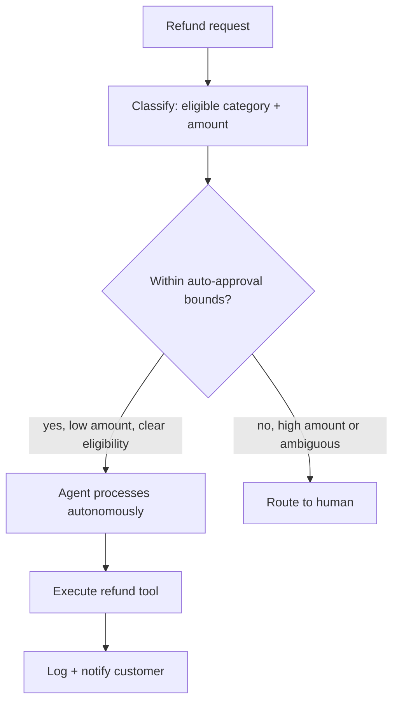

Yesterday's RAG walkthrough covered retrieval-heavy design. This post walks the agent equivalent — "design a system that can autonomously handle refund requests" — which tests a distinct, harder set of instincts around autonomy and risk.

## Step 1: The Clarifying Questions That Matter Most for Agents

```python
agent_specific_clarifying_questions = [
    "What's the maximum dollar amount this system could authorize on its own, if any?",  # scopes the risk immediately
    "What actions are reversible vs irreversible?",  # March's core guardrails question
    "What's the expected task complexity — single-step lookups or genuinely multi-step reasoning?",
    "How should the system behave when uncertain?",
]
```

The first question is the one that most distinguishes a candidate who's internalized this roadmap's guardrails content — immediately probing the blast radius of autonomous action, before any architecture discussion, signals the risk-first thinking September's entire series was built around.

## Step 2: Architecture



Narrating this as "I'm deliberately keeping the autonomous path narrow — bounded dollar amount, clear eligibility criteria — and routing everything else to a human" makes the guardrail-first design philosophy explicit rather than leaving the interviewer to infer it from the diagram alone.

## Step 3: The Tool Design Discussion

```python
def design_refund_tool_for_interview() -> dict:
    return {
        "scope": "the tool itself enforces a max amount, not just the prompt instructions (Sep's least-privilege principle)",
        "idempotency": "an idempotency key prevents a retry from double-refunding (Oct's idempotent-tools post)",
        "audit_trail": "every autonomous refund is logged with full reasoning (Sep's audit logging post)",
    }
```

Mentioning that the guardrail lives in the tool's own implementation, not just the prompt — "even if the model is somehow manipulated, the tool itself won't process a refund above the cap" — demonstrates the defense-in-depth thinking from September's prompt injection posts, a meaningfully more sophisticated answer than relying on prompt instructions alone.

## Step 4: Handling the "What Could Go Wrong" Follow-Up

```python
failure_mode_discussion = {
    "prompt_injection_via_request_text": "a customer's message could contain manipulative text — Sep's injection defenses apply",
    "runaway_loop": "budget/step guardrails (Mar's post) prevent unbounded cost from a stuck agent",
    "silent_over_refunding": "the idempotency and tool-level cap catch this even under retry/failure scenarios",
}
```

This is almost always asked in some form, and having concrete, specific answers — not just "we'd add guardrails" — demonstrates the depth this roadmap covered rather than surface familiarity with the term "guardrails" alone.

## Step 5: Evaluation for an Agent, Not Just a RAG System

```python
def address_agent_evaluation_in_interview() -> str:
    return ("Task success rate against a golden set of real refund scenarios (Jun's agent evaluation post), "
            "plus specific safety metrics — false-approval rate, escalation-appropriateness — tracked separately "
            "from raw task success, since those failure modes matter more than general quality here.")
```

Distinguishing safety metrics from general quality metrics in the evaluation discussion shows understanding that an agent with real-world side effects needs a different evaluation emphasis than a pure information-retrieval system — exactly June and September's combined content applied correctly to this specific risk profile.

## What a Weak Answer Looks Like, for Contrast

A candidate who designs the same ReAct loop and tool set but never mentions bounding autonomous authority, never discusses idempotency, and treats evaluation as "check if the answer is right" has demonstrated agent *mechanics* knowledge without the risk judgment that actually matters for shipping something like this safely — the gap interviewers are specifically probing for.

## Practicing This Specific Interview Type

Rehearse this exact prompt shape — "design a system that can autonomously do X with real consequences" — across a few different domains (refunds, account changes, scheduling) until the guardrail-first instinct becomes automatic rather than something you have to consciously remember to mention.

---

*Part of the [Career series]({{ site.baseurl }}/tags/career-series/) — next: [common AI engineering interview questions]({{ site.baseurl }}/posts/common-ai-engineering-interview-questions/) and how to answer them.*
