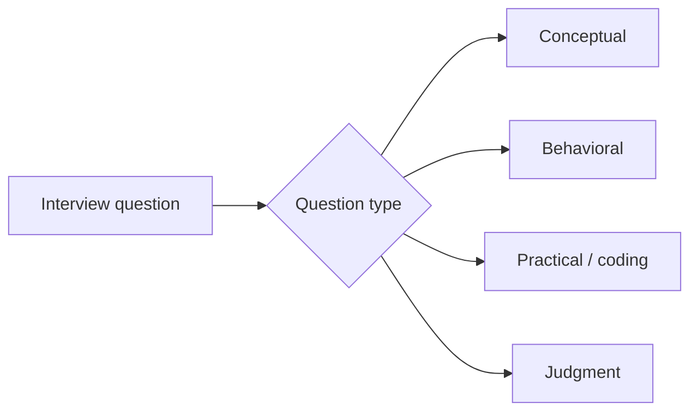

Beyond system design, most AI engineering interviews include a round of shorter, direct questions testing specific knowledge. This post compiles the most common ones with strong-answer frameworks, mapped back to where this roadmap covered each.



The four categories below test genuinely different things — conceptual and practical questions probe knowledge, while behavioral and judgment questions probe whether that knowledge translates into good decisions under real constraints.

## Conceptual Questions

```python
conceptual_qa = {
    "explain_the_difference_between_rag_and_fine_tuning": "May's decision framework — facts vs behavior, cost tradeoffs",
    "what_is_a_context_window_and_why_does_it_matter": "March's LLM fundamentals series",
    "explain_temperature_and_when_youd_change_it": "prompt engineering series — determinism vs creativity tradeoff",
    "what_is_prompt_injection_and_how_do_you_defend_against_it": "September's layered-defense answer",
}
```

For each of these, a strong answer goes beyond definition into *when it matters practically* — "temperature controls sampling randomness" is a weak answer; "I'd use temperature 0 for extraction tasks where I need consistency, and higher for creative generation, because..." demonstrates the applied understanding interviewers actually want.

## "Tell Me About a Time" Behavioral Questions, AI-Specific

```python
behavioral_prompts = {
    "tell_me_about_debugging_a_model_that_wasnt_working_as_expected": "showcase the trace-reading discipline from June",
    "tell_me_about_a_tradeoff_you_made_between_cost_and_quality": "November's cost-modeling instincts applied to a real decision",
    "tell_me_about_a_time_you_caught_a_safety_issue_before_it_shipped": "September's red-teaming mindset, demonstrated concretely",
}
```

Structuring these with the standard STAR format (Situation, Task, Action, Result) still applies — the AI-specific value-add is making sure the "Action" section demonstrates a specific technical practice from this roadmap (not just "I looked into it and fixed it"), since vague answers to these questions are a common way strong technical candidates undersell themselves.

## Practical/Coding Questions

```python
practical_question_examples = {
    "write_a_function_to_chunk_a_document": "tests March's chunking-strategy understanding in code",
    "implement_a_simple_retry_with_backoff": "tests August's resilience patterns",
    "design_a_schema_for_structured_extraction": "tests the Pydantic-validation pattern from the LLM engineering series",
}
```

These test whether conceptual knowledge translates into working code under mild time pressure — practicing writing these specific patterns from memory (not just recognizing them when reading) closes the gap between "I understand RAG" and "I can implement a reasonable chunker in fifteen minutes."

## Questions Testing Judgment, Not Just Knowledge

```python
judgment_questions = {
    "when_would_you_NOT_use_an_agent": "April's guardrails post — deterministic pipelines are often the right call",
    "when_is_a_smaller_cheaper_model_the_right_choice": "August/June's cost-quality tradeoff instincts",
    "how_would_you_convince_a_skeptical_stakeholder_this_feature_is_safe_to_ship": "connects to tomorrow's stakeholder-communication post",
}
```

These are often the highest-signal questions in an interview — anyone can recite what a technique does, but explaining *when not to use it* requires the deeper, more senior-level understanding this entire roadmap has tried to build throughout, not just at the end.

## A Preparation Framework

```python
def prepare_for_interview_question_bank(roadmap_topics: list[str]) -> dict:
    return {
        topic: {
            "one_sentence_definition": write_concise_definition(topic),
            "when_to_use_it": write_practical_application(topic),
            "when_not_to_use_it": write_counter_case(topic),
            "a_concrete_example_from_your_own_projects": link_to_portfolio_project(topic),
        }
        for topic in roadmap_topics
    }
```

Preparing this structure for the roadmap's major topics (RAG, agents, fine-tuning, evaluation, guardrails, infrastructure) — not memorized scripts, but genuinely internalized enough to speak fluently — is what makes an interview feel like a conversation about real understanding rather than a recall quiz.

## Questions You Should Ask the Interviewer

```python
strong_candidate_questions = [
    "What does your evaluation and observability stack look like?",  # signals June's series is genuinely internalized
    "How does the team think about the build-vs-buy decision for AI infrastructure?",  # November's framing
    "What's your incident response process for an AI-specific failure?",  # September's series
]
```

Asking these signals genuine practitioner-level engagement with the field, not just interview-prep memorization — and it gives real, useful signal about whether the team's practices match the rigor this roadmap has advocated throughout.

---

*Part of the [Career series]({{ site.baseurl }}/tags/career-series/) — next: [take-home assignments]({{ site.baseurl }}/posts/take-home-assignments-what-interviewers-look-for/), what interviewers actually evaluate in a longer-form exercise.*
