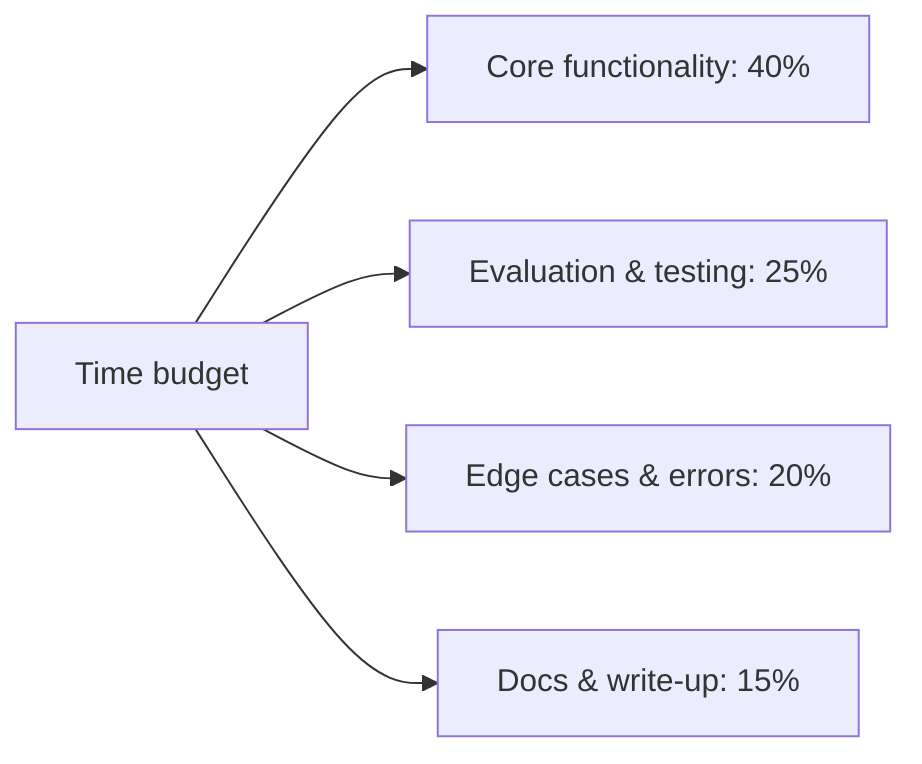

A take-home assignment gives more time than a whiteboard interview but is evaluated more holistically — this post covers what actually gets weighted in review, which is often not what candidates assume.



Most candidates allocate their time roughly opposite of this split, over-investing in a polished demo and under-investing in evaluation and documentation — exactly the two categories a production-minded reviewer weights most heavily.

## What Gets More Weight Than Candidates Expect

```python
often_underweighted_by_candidates = {
    "evaluation_of_the_solution": "did you build a way to know if it works, not just build it (June's core habit)",
    "handling_of_edge_cases": "an unanswerable query, malformed input — not just the happy path",
    "clear_explanation_of_tradeoffs": "the README explaining *why*, not just *what*",
    "appropriate_scope": "a focused, well-executed narrow solution beats an ambitious, half-finished broad one",
}
```

Most candidates over-index on making the demo impressive and under-index on evaluation and edge-case handling — exactly inverted from what a reviewer assessing "would I trust this person to build production AI features" actually weights most heavily.

## A Realistic Time Allocation

```python
recommended_time_allocation = {
    "core_functionality": "40%",
    "evaluation_and_testing": "25%",  # commonly under-invested by candidates
    "edge_case_and_error_handling": "20%",
    "documentation_and_write_up": "15%",
}
```

Deliberately budgeting real time for evaluation and documentation — not treating them as an afterthought once the "real" building is done — produces a submission that reads as production-minded rather than demo-minded, directly reflecting this roadmap's throughline from March onward.

## What a Strong README Includes

```markdown
## Approach
[Brief explanation of the chosen architecture and why]

## Evaluation
[How you tested this — even a small golden set of 10-15 examples with results]

## Known limitations
[Honest, specific — this is a positive signal, not a confession of failure]

## What I'd do with more time
[Shows awareness of the fuller production picture without needing to have built all of it]
```

The "known limitations" section, following December 1's portfolio advice directly, is one of the highest-signal sections in a take-home submission — it demonstrates the calibrated honesty this roadmap has emphasized throughout, and its absence (a submission that implies the solution is complete and flawless) is itself a mild red flag to an experienced reviewer.

## Common Mistakes That Hurt More Than They Should

```python
take_home_mistakes = {
    "no_tests_at_all": "even a few eval examples matter more than perfect code coverage",
    "over_engineering": "building a full microservices architecture for a scoped take-home signals poor judgment about proportionate effort",
    "ignoring_the_stated_time_budget": "submitting something that clearly took 15 hours when 4 were suggested signals poor scoping judgment, not just extra effort",
    "no_error_handling_at_all": "even minimal handling of an obviously-likely failure case (empty input, API timeout) matters",
}
```

Respecting the stated time budget is worth emphasizing — reviewers often specifically evaluate scoping judgment, and a candidate who visibly over-invested time to compensate for a less clever approach is showing exactly the kind of poor prioritization instinct that's costly on a real team with real deadlines.

## If the Assignment Involves an LLM Component

```python
llm_specific_expectations = {
    "prompt_shown_and_explained": "not just the API call — the actual prompt engineering reasoning",
    "cost_awareness_mentioned": "even a rough estimate — 'this costs approximately $X per 1000 requests'",
    "a_basic_guardrail_or_failure_mode_consideration": "shows March's principles weren't just theoretical for this roadmap's reader",
}
```

## After Submission: Being Ready to Discuss It

Most take-home processes include a follow-up conversation — being able to discuss *why* you made specific choices (not just what you built) in that conversation is where the deeper evaluation actually happens, and it's exactly what December 1 through 5's interview-preparation content is meant to prepare you for.

## The Meta-Skill Being Tested

A take-home assignment is, in miniature, a test of whether you'd actually apply this roadmap's practices without being explicitly told to at every step — the same evaluation, guardrail, and documentation instincts that should now feel automatic after nine months of this roadmap's content, applied under realistic time constraints.

---

*Part of the [Career series]({{ site.baseurl }}/tags/career-series/) — next: [explaining LLM tradeoffs to non-technical stakeholders]({{ site.baseurl }}/posts/explaining-llm-tradeoffs-stakeholders/), a skill both interviews and real jobs demand.*
