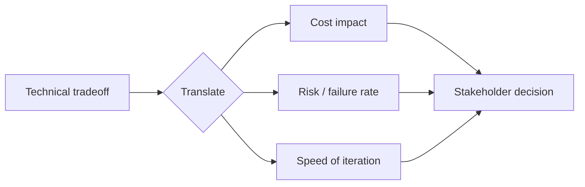

Every technical decision this roadmap has covered eventually needs to be explained to someone without the technical background to follow the reasoning directly — a product manager, an executive, a customer. This is a distinct, learnable skill worth its own treatment.



The translation step doesn't remove technical substance — it re-expresses the same tradeoff in the three terms (cost, risk, iteration speed) a stakeholder actually needs to make a good call, as the sections below work through concretely.

## Translating Technical Tradeoffs Into Business Language

```python
translation_examples = {
    "rag_vs_fine_tuning": {
        "technical": "RAG grounds responses in retrieved context; fine-tuning bakes behavior into weights",
        "business": "RAG lets us update what the AI knows instantly by changing a document; fine-tuning would mean retraining every time our policies change",
    },
    "model_choice_tradeoff": {
        "technical": "the smaller model has lower latency and cost but a measurably higher error rate on complex queries",
        "business": "the cheaper option answers 90% of questions well and costs a third as much, but we'd need a fallback for the harder 10%",
    },
}
```

The translation isn't dumbing down the content — it's re-framing the same tradeoff in terms of the consequences a business stakeholder actually needs to weigh (cost, speed of iteration, risk), stripped of the implementation mechanism they don't need to evaluate the decision.

## Explaining Uncertainty and Failure Rates Honestly

```python
def explain_quality_bar_to_stakeholder(eval_results: dict) -> str:
    return (f"In our testing, this answers correctly about {eval_results['accuracy']:.0%} of the time. "
            f"For the other cases, it either says it's not sure and asks for help, or hands off to a human — "
            f"it's designed to fail visibly rather than guess.")
```

This directly translates March's "visibly wrong beats confidently wrong" principle and June's evaluation results into stakeholder-comprehensible language — avoiding both the mistake of overselling ("it's basically perfect") and under-explaining ("it uses AI so results may vary"), neither of which gives a stakeholder what they actually need to make a good decision.

## Using Concrete Examples Over Abstract Explanations

```python
communication_technique = {
    "weak": "the model has a hallucination rate that increases with context complexity",
    "strong": "show them an actual example of the model getting something right, and an actual example of it hedging appropriately on something uncertain — let the pattern speak for itself",
}
```

Concrete, real examples (pulled directly from the golden set or production traces, per June's practices) communicate a system's actual behavior far more effectively than an abstract description of error rates — stakeholders build accurate mental models from examples much faster than from statistics alone.

## Handling the "Why Can't It Just Be 100% Accurate" Question

```python
def address_the_100_percent_question() -> str:
    return ("No AI system — or honestly, no human process either — is 100% accurate. What we can control "
            "is making sure it knows when it's uncertain and routes to a human instead of guessing. "
            "That's what the evaluation numbers and the escalation design are for.")
```

Reframing the conversation from "why isn't it perfect" to "here's how we've designed for imperfection" is a genuinely persuasive move when it's backed by real evaluation rigor (June) and a real escalation design (March/April) — it only works, though, if that rigor actually exists, which is exactly why this roadmap emphasized building it rather than skipping to the communication skill alone.

## Communicating Cost and ROI in Stakeholder Terms

Directly connecting to November 15's ROI framework — a stakeholder conversation about whether to invest further in an AI feature should present the cost-per-unit and business-value numbers from that framework, not raw infrastructure metrics, since those are the terms in which the actual decision gets made.

## Building Trust Through Consistent, Honest Communication Over Time

```python
def stakeholder_trust_building_pattern():
    return [
        "under-promise slightly rather than over-promise",
        "proactively flag known limitations before they're discovered as surprises",
        "bring data (June's eval results) to every claim, not just assertions",
    ]
```

This mirrors November 22's user-trust dynamics exactly, applied to internal stakeholder relationships — trust in your technical judgment, built through consistently honest and evidence-based communication over many interactions, is what earns the latitude to make good technical decisions without every one being second-guessed.

---

*Part of the [Career series]({{ site.baseurl }}/tags/career-series/) — next: [writing a technical blog to build your AI engineering brand]({{ site.baseurl }}/posts/technical-blog-ai-engineering-brand/).*
