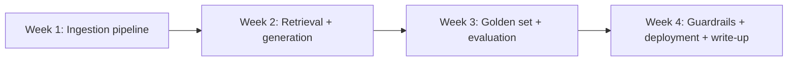

Eight capstone projects close out this roadmap, each a complete, portfolio-worthy build drawing on specific months of content. First: a production-grade RAG chatbot over your own document set — the foundational project every AI engineer should have.

## Project Brief

Build a chatbot that answers questions over a personal or public document set (your own notes, a public knowledge base, documentation for an open-source project) with proper citations, graceful handling of unanswerable questions, and a real evaluation suite behind it.

## Requirements

```python
capstone_1_requirements = {
    "ingestion": "chunking strategy of your choice, justified in your write-up (March's chunking post)",
    "retrieval": "hybrid search (vector + keyword) at minimum, reranking as a stretch goal",
    "generation": "citation-grounded answers, explicit 'I don't know' handling",
    "evaluation": "a golden set of 30+ examples, faithfulness and relevancy scores (June's RAGAS-style metrics)",
    "guardrails": "basic input/output filtering (September's series)",
    "deployment": "a working, publicly accessible demo (December 19's deployment post)",
}
```

## Milestones



## What Distinguishes a Strong Submission

```python
strong_submission_signals = {
    "beyond_happy_path": "explicit handling of no-results and ambiguous queries, not just working demo queries",
    "real_evaluation_numbers": "actual faithfulness/relevancy scores, not just 'it seems to work'",
    "documented_tradeoffs": "why this chunking strategy, why this embedding model — December 1's portfolio principle",
    "cost_awareness": "an estimate of cost per query, even roughly",
}
```

## Evaluation Rubric for Self-Assessment

```python
def self_evaluate_capstone_1(project: dict) -> dict:
    return {
        "has_golden_set": project.get("golden_set_size", 0) >= 30,
        "reports_faithfulness_score": "faithfulness_score" in project,
        "handles_unanswerable_gracefully": project.get("unanswerable_test_passed", False),
        "has_deployed_demo": project.get("demo_url") is not None,
        "documents_tradeoffs": len(project.get("documented_decisions", [])) >= 3,
    }
```

Use December 18's full self-assessment checklist once this project is complete — this rubric is a starting checkpoint, not the complete bar.

## Stretch Goals

```python
stretch_goals = {
    "multimodal_rag": "extend to include images or tables from source documents (July's series)",
    "conversation_memory": "multi-turn context awareness (March's memory posts)",
    "graphrag": "for a corpus that benefits from synthesis-style queries (October's GraphRAG post)",
}
```

## Common Pitfalls to Avoid

```python
common_capstone_1_pitfalls = {
    "skipping_evaluation": "the single most common shortcut — don't skip it, it's the most valuable part of the project",
    "using_a_tiny_toy_corpus": "a corpus of 3 documents doesn't exercise real retrieval challenges",
    "no_citation_verification": "generating citations that don't actually trace back to real retrieved content",
}
```

## Why This Project First

RAG is the foundational pattern this entire roadmap builds from — March's series, but this capstone is where it becomes genuinely yours, not a worked example from a tutorial. Every subsequent capstone assumes this level of comfort with the retrieval-generation-evaluation loop.

---

*Part of the [Career series]({{ site.baseurl }}/tags/career-series/) — next: [Capstone 2: a multi-agent research assistant]({{ site.baseurl }}/posts/capstone-2-multi-agent-research-assistant/).*
