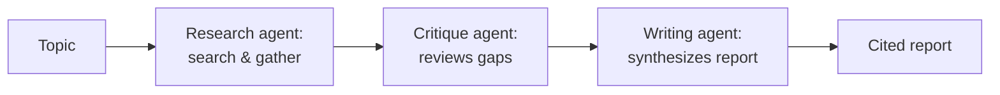

Second capstone: a multi-agent system that researches a topic across multiple sources and produces a cited report — drawing on March/April's agent series and October's deep dives.



This three-agent pipeline is the suggested architecture below — the critique agent is the piece that distinguishes it from a simple two-step pipeline, demonstrating October 23's reflection pattern rather than just basic agent coordination.

## Project Brief

Build a system with at least two distinct agents (a research/search agent and a writing/synthesis agent, minimum) that takes a topic and produces a structured, cited report, with the coordination pattern of your choice (manager-worker, sequential pipeline, or debate).

## Requirements

```python
capstone_2_requirements = {
    "multi_agent_architecture": "at least 2 distinct agents with a clear division of responsibility (March's coordination patterns)",
    "framework_choice": "LangGraph, CrewAI, or AutoGen — justify your choice (April's comparison)",
    "guardrails": "budget limits, loop detection (March's guardrails post)",
    "evaluation": "task success rate against a golden set of research topics (June's agent evaluation)",
    "tracing": "full trace visibility for debugging (June's observability series)",
}
```

## Suggested Architecture

```python
suggested_agents = {
    "research_agent": "searches and gathers findings with citations",
    "critique_agent": "reviews the research agent's output for gaps or unsupported claims (October's reflection pattern)",
    "writing_agent": "synthesizes findings into a structured report",
}
```

Including a critique/reflection agent (October 23's pattern) is a strong way to demonstrate more than the basic multi-agent mechanics — it shows understanding of the quality-improvement patterns beyond simple pipeline composition.

## Milestones

```python
milestones = {
    "week_1": "single research agent working with search tools",
    "week_2": "add the writing/synthesis agent, wire up coordination",
    "week_3": "guardrails, budget limits, loop detection; build the golden set",
    "week_4": "evaluation, tracing/observability, deployment, write-up",
}
```

## Evaluation Rubric

```python
def self_evaluate_capstone_2(project: dict) -> dict:
    return {
        "has_distinct_agent_roles": len(project.get("agents", [])) >= 2,
        "has_budget_guardrails": project.get("has_step_and_cost_limits", False),
        "citations_are_real": project.get("citation_verification_passed", False),
        "has_traced_debugging": project.get("has_tracing", False),
        "measured_task_success_rate": "task_success_rate" in project,
    }
```

## What Makes This Project Hard (and Worth Doing)

Unlike the RAG capstone's relatively well-defined success criteria, evaluating a research report's quality is genuinely harder — this is a deliberate opportunity to practice June's LLM-as-judge techniques against subjective, open-ended output, a skill directly transferable to real production evaluation work.

## Stretch Goals

```python
stretch_goals = {
    "human_in_the_loop_approval": "pause for approval before the final report is finalized (April's pattern)",
    "add_a_debate_step": "two agents argue different interpretations before synthesis (October's debate post)",
    "deploy_as_a_durable_workflow": "using Temporal or a workflow engine for genuinely long research tasks (October's series)",
}
```

## Common Pitfalls

```python
pitfalls = {
    "no_real_coordination_logic": "two agents that don't actually depend on each other's output isn't a meaningful multi-agent system",
    "unbounded_cost": "no budget guardrail means a stuck loop could run indefinitely — test this explicitly",
    "fabricated_citations": "verify every citation actually traces to a real retrieved source",
}
```

## Connecting to the Job Search

This project directly demonstrates the agentic-system design skills December 4's whiteboard interview post covers — being able to walk an interviewer through this project's architecture and coordination decisions is excellent, concrete interview preparation.

---

*Part of the [Career series]({{ site.baseurl }}/tags/career-series/) — next: [Capstone 3: an MCP server for your own tools]({{ site.baseurl }}/posts/capstone-3-mcp-server-own-tools/).*
