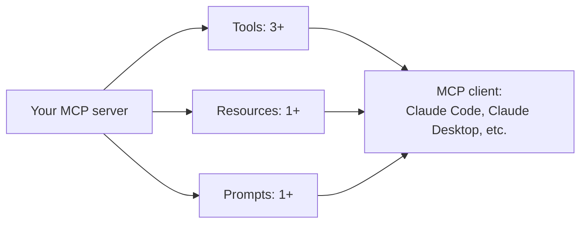

Third capstone: build and publish a genuine MCP server — directly extending March's MCP series and October's advanced-patterns post, and connecting to December 9's open-source contribution advice.



The requirements below map directly onto MCP's three primitive types — a server that only exposes tools and skips resources or prompts doesn't demonstrate the full protocol this roadmap's March and October coverage described.

## Project Brief

Build an MCP server exposing tools, resources, and at least one prompt for a real capability — your own personal task tracker, a public API you find useful, or a genuinely useful developer tool — and publish it for others to use with Claude Code, Claude Desktop, or any other MCP client.

## Requirements

```python
capstone_3_requirements = {
    "at_least_3_tools": "well-scoped, with clear descriptions (April's tool-design principles)",
    "at_least_1_resource": "browsable reference content (October's resources/prompts post)",
    "at_least_1_prompt": "a reusable, parameterized template",
    "proper_error_handling": "tools fail gracefully with informative messages, not raw stack traces",
    "security_review": "least-privilege scoping, credential handling (September's series applied to your own server)",
}
```

## Suggested Project Ideas

```python
project_ideas = {
    "personal_knowledge_base_server": "expose your notes/bookmarks as searchable resources",
    "public_api_wrapper": "wrap a public API you use often (weather, a data source, a project management tool)",
    "developer_productivity_tool": "expose a genuinely useful capability for your own workflow",
}
```

## Milestones

```python
milestones = {
    "week_1": "core tools working, tested locally with a real MCP client",
    "week_2": "add resources and prompts, error handling, credential management (September's secrets post)",
    "week_3": "write tests, documentation, and a clear README (November's documentation practices)",
    "week_4": "publish, write up the security review, submit to an MCP server directory if appropriate",
}
```

## Security Self-Review Checklist

```python
def security_self_review(server: dict) -> dict:
    return {
        "no_hardcoded_credentials": not contains_hardcoded_secrets(server["code"]),
        "least_privilege_scoped": every_tool_has_minimum_necessary_access(server),
        "input_validation_present": every_tool_validates_arguments(server),
        "no_unbounded_resource_access": has_appropriate_limits(server),
    }
```

Applying September's supply-chain and least-privilege discipline to your own published server matters doubly here — you're not just building for yourself, you're potentially publishing something others will grant tool access to, carrying real responsibility for its security posture.

## Evaluation Rubric

```python
def self_evaluate_capstone_3(project: dict) -> dict:
    return {
        "all_three_primitive_types_used": project.get("has_tools") and project.get("has_resources") and project.get("has_prompts"),
        "has_tests": project.get("test_coverage", 0) > 0,
        "documented_and_published": project.get("is_published", False),
        "security_reviewed": all(security_self_review(project).values()),
    }
```

## Stretch Goals

```python
stretch_goals = {
    "add_oauth_or_proper_auth": "beyond a simple API key, for a server that needs real access control",
    "get_a_genuine_external_user": "someone other than you actually finds it useful — the strongest signal of real value",
    "contribute_it_to_an_official_mcp_registry": "connects directly to December 9's open-source contribution post",
}
```

## Why This Project Is Distinctive on a Resume

Most portfolios show applications built *using* AI. A published MCP server demonstrates building *infrastructure for* AI systems — a genuinely different and valuable signal, particularly relevant given how much of this roadmap (March, April, October) centered on MCP as foundational infrastructure for the whole ecosystem.

---

*Part of the [Career series]({{ site.baseurl }}/tags/career-series/) — next: [Capstone 4: a fine-tuned domain model]({{ site.baseurl }}/posts/capstone-4-fine-tuned-domain-model/).*
