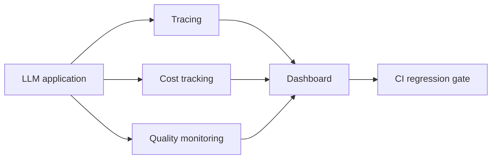

Fifth capstone: build a complete observability stack for an existing project (ideally one of your earlier capstones), following June's full evaluation and observability series.



The three instrumentation streams — tracing, cost, and quality — all feed one dashboard, and the dashboard in turn feeds a CI gate that can actually block a regression, which is the concrete demonstration the requirements below ask for.

## Project Brief

Instrument an LLM application with tracing, cost tracking, and quality monitoring, then build a dashboard surfacing the key metrics from June's closing reference-stack post — turning an application that "seems to work" into one with real, continuous evidence of quality.

## Requirements

```python
capstone_5_requirements = {
    "tracing": "structured spans for every LLM call and tool call (June's trace-structuring post)",
    "cost_tracking": "per-request cost logged and aggregatable by feature",
    "quality_monitoring": "at least one reference-free metric (faithfulness, or a custom judge) sampled continuously",
    "golden_set_and_ci_gate": "a small golden set with a CI regression check (June's earlier posts)",
    "dashboard": "a working dashboard surfacing volume, latency, cost, and quality trends",
}
```

## Suggested Approach: Build vs Use a Platform

```python
approach_options = {
    "hand_rolled": "build the harness from scratch (June's from-scratch eval harness post) — most educational",
    "use_langfuse_or_similar": "integrate an open-source platform (June's Langfuse post) — faster, production-realistic",
    "hybrid": "use a platform for tracing, hand-roll the specific evaluation logic your project needs",
}
```

Either choice is defensible for this capstone — what matters is understanding what's actually happening underneath, which is why even choosing the platform route should include reading and being able to explain what the platform is doing internally, not just wiring it up.

## Milestones

```python
milestones = {
    "week_1": "structured tracing instrumented across an existing project",
    "week_2": "cost tracking and attribution, golden set built",
    "week_3": "CI regression gate, quality monitoring on synthetic 'production' traffic",
    "week_4": "dashboard build, drift-detection demo, write-up",
}
```

## A Concrete Demonstration Worth Including

```python
def demonstrate_the_dashboards_value(dashboard: dict) -> dict:
    # Deliberately introduce a regression (a worse prompt, a cheaper model) and show the dashboard catching it
    baseline_metrics = capture_metrics_before_change()
    apply_deliberate_regression()
    after_metrics = capture_metrics_after_change()
    return {"dashboard_caught_regression": after_metrics["quality_score"] < baseline_metrics["quality_score"] - THRESHOLD}
```

Deliberately introducing and then catching a regression is a genuinely compelling demonstration for a portfolio write-up — it proves the observability investment actually works, rather than just existing, directly connecting to November 30's business-case-for-observability post.

## Evaluation Rubric

```python
def self_evaluate_capstone_5(project: dict) -> dict:
    return {
        "traces_are_structured_and_correlatable": project.get("has_correlation_ids", False),
        "cost_attributable_by_feature": project.get("cost_breakdown_by_feature", False),
        "ci_gate_actually_blocks_a_regression": project.get("demonstrated_regression_catch", False),
        "dashboard_is_genuinely_navigable": project.get("dashboard_url") is not None,
    }
```

## Stretch Goals

```python
stretch_goals = {
    "add_drift_detection": "June's canary-set behavioral drift monitoring",
    "add_statistical_significance_testing": "for comparing two prompt/model variants (June's stats post)",
    "instrument_a_multi_step_agent": "structuring traces for a genuinely multi-step system (June's agent-debugging post)",
}
```

## Why This Project Is Distinctively Valuable

Most portfolios demonstrate building features. This one demonstrates the operational maturity to run those features responsibly in production — a genuinely underrepresented but highly valued skill, and one that directly signals the kind of engineer who'd be trusted with production on-call responsibility from day one.

---

*Part of the [Career series]({{ site.baseurl }}/tags/career-series/) — next: [Capstone 6: a voice-enabled support agent]({{ site.baseurl }}/posts/capstone-6-voice-enabled-support-agent/).*
