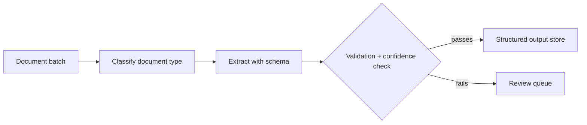

Seventh capstone: a batch document extraction pipeline processing real documents at scale, following July's document AI series and its production pipeline post specifically.

## Project Brief

Build a pipeline that processes a batch of real documents (invoices, resumes, forms — pick a document type you can source realistic examples of) into structured, validated data, with confidence-based routing to a review queue.

## Requirements

```python
capstone_7_requirements = {
    "extraction": "VLM-based structured extraction with a strict Pydantic schema (July's invoice extraction post)",
    "validation": "domain-specific validators, not just schema-shape checks (July's arithmetic-consistency example)",
    "confidence_routing": "low-confidence extractions flagged for review, not silently trusted",
    "batch_processing": "queue-based or batched processing of multiple documents, not one-at-a-time only",
    "evaluation": "a golden set of real (or realistic synthetic) documents with hand-verified correct extractions",
}
```

## Architecture



## Milestones

```python
milestones = {
    "week_1": "single-document extraction working with a strict schema and validators",
    "week_2": "confidence scoring and review-queue routing",
    "week_3": "batch/queue processing for multiple documents, idempotent and resumable",
    "week_4": "golden set, evaluation, write-up including accuracy and cost-per-document numbers",
}
```

## The Validation Layer Is What Separates This From a Toy Demo

```python
def validate_extraction(extracted: dict, schema: type) -> dict:
    validated = schema.model_validate(extracted)  # structural validation
    # Domain-specific validation beyond schema shape:
    if hasattr(validated, "line_items") and hasattr(validated, "total"):
        expected_total = sum(item.total for item in validated.line_items)
        if abs(validated.total - expected_total) > 0.01:
            return {"valid": False, "reason": "total doesn't match line items"}
    return {"valid": True}
```

Including a domain-specific consistency check (not just "does the JSON parse") is exactly what July's post identified as the difference between a demo and something trustworthy enough for real use — worth making a deliberate, visible part of the project rather than an afterthought.

## Evaluation Rubric

```python
def self_evaluate_capstone_7(project: dict) -> dict:
    return {
        "has_domain_specific_validation": project.get("has_consistency_checks", False),
        "confidence_routing_actually_works": project.get("low_confidence_examples_correctly_flagged_rate", 0) > 0.8,
        "processes_a_real_batch": project.get("batch_size_tested", 0) >= 20,
        "measured_extraction_accuracy": "field_level_accuracy" in project,
        "idempotent_processing": project.get("survives_simulated_crash_and_resume", False),
    }
```

## Stretch Goals

```python
stretch_goals = {
    "handle_handwriting": "July's handwriting-recognition post's specific reliability caveats",
    "add_table_extraction": "July's table-extraction post, for documents containing tables",
    "build_a_review_ui": "a simple interface for a human to confirm or correct flagged extractions",
}
```

## Common Pitfalls

```python
pitfalls = {
    "no_validation_beyond_json_parsing": "misses exactly the errors most likely to matter in a real deployment",
    "processing_documents_one_at_a_time_only": "doesn't demonstrate the batch/queue infrastructure July's production post covered",
    "no_confidence_signal_at_all": "treats every extraction as equally trustworthy, which real documents never are",
}
```

## Why This Project Resonates With Hiring Managers

Document processing is one of the most common, concretely valuable real-world AI application categories — a well-built version of this capstone maps directly onto genuine business problems many companies have, making it an easy project for an interviewer to immediately see the applicability of.

---

*Part of the [Career series]({{ site.baseurl }}/tags/career-series/) — next: [Capstone 8: a secure agentic coding assistant]({{ site.baseurl }}/posts/capstone-8-secure-agentic-coding-assistant/), the final and most comprehensive capstone.*
