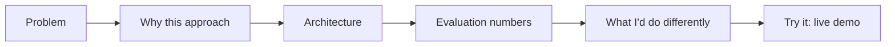

A live demo (yesterday's post) shows a capstone works. A case study explains how and why — directly combining December 1's portfolio principles and December 8's technical writing advice into the single most important piece of content for any capstone project.



This is the structure the rest of the post walks through — leading with the *reasoning* behind the approach, not the implementation, is what actually demonstrates the engineering judgment a reviewer is looking for.

## The Case Study Structure That Works

```markdown
## The Problem
[What need this addresses, in one or two sentences]

## Why This Approach
[The key architectural decision and the reasoning — May's RAG-vs-fine-tuning framework or equivalent]

## Architecture
[Diagram + brief walkthrough]

## Evaluation
[Golden set size, metrics, actual numbers — June's discipline made visible]

## What I'd Do Differently
[Honest reflection — demonstrates growth mindset and technical maturity]

## Try It
[Live demo link, from yesterday's post]
```

## Leading With the Decision, Not the Implementation

```python
weak_vs_strong_opening = {
    "weak": "I built a RAG chatbot using LangChain and Pinecone that answers questions about my documents.",
    "strong": "I needed a Q&A system where users could trust every answer was grounded in real source material — "
               "which meant RAG over fine-tuning was the clear choice, since facts needed to update without retraining.",
}
```

The strong version leads with the *reasoning*, which is what actually demonstrates engineering judgment — the tools used are almost incidental detail that can follow, not the headline, echoing December 1's portfolio principle that judgment matters more than execution alone.

## Including Real Numbers, Not Vague Claims

```python
case_study_evidence_examples = {
    "vague": "the system performs well",
    "concrete": "faithfulness score of 0.89 on a 40-example golden set, with the 4 failures traced to a chunking edge case I documented below",
}
```

Concrete, specific numbers — even modest ones, even with acknowledged limitations — read as far more credible than vague positive claims, and they demonstrate June's evaluation discipline was genuinely applied, not just claimed.

## Writing the "What I'd Do Differently" Section Honestly

```python
honest_reflection_examples = [
    "I'd build the golden set before writing any code, not after — I found real gaps late that earlier testing would have caught sooner",
    "I underestimated how much the chunking strategy mattered — I'd benchmark 2-3 strategies from the start next time",
    "I'd add cost tracking from day one rather than retrofitting it",
]
```

This section is disproportionately valuable in a case study — it demonstrates the reflective, continuously-improving mindset that's more predictive of strong on-the-job performance than a project that reads as if everything went perfectly the first time, which experienced reviewers correctly find less credible.

## Tailoring the Case Study to Different Audiences

```python
def adapt_case_study(base_content: dict, audience: str) -> str:
    if audience == "technical_deep_dive":
        return include_full_code_snippets_and_architecture_detail(base_content)
    if audience == "recruiter_or_hiring_manager_skim":
        return lead_with_a_tight_summary_and_metrics(base_content)
```

Having both a full technical write-up and a condensed summary (a few sentences plus the key metrics) serves both the quick-skimming reviewer and the technically curious one who wants to go deep — matching November 15's audience-appropriate reporting principle, applied to your own portfolio content.

## Publishing the Case Study Alongside the Code

```python
publishing_checklist = {
    "on_your_blog": "connects to December 8's technical writing post — this is exactly the kind of high-value post topic",
    "in_the_project_readme": "for anyone who lands directly on the repo",
    "linked_from_your_resume_or_portfolio_site": "make it easy to find, not buried",
}
```

## The Compounding Value of Doing This for Every Capstone

Writing this case study for even a few of December's eight capstones, following this consistent structure, builds exactly the body of demonstrable, judgment-revealing work that December 1's portfolio post and December 8's blogging post both described — the case studies themselves become the portfolio, not just a description of it.

---

*Part of the [Career series]({{ site.baseurl }}/tags/career-series/) — next: [freelancing as an AI engineer]({{ site.baseurl }}/posts/freelancing-ai-engineer-first-clients/), an alternative path this portfolio work also supports.*
