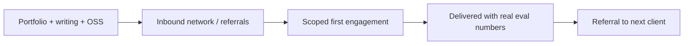

Not every path from this roadmap leads to full-time employment — freelance and consulting work is a genuine, viable path for an AI engineer, and it draws directly on this month's portfolio and case-study content to find and win early clients.



The loop closes on itself — a well-delivered, well-evaluated first engagement is the strongest source of the next client, making delivery quality the actual growth engine, more than marketing spend or platform reputation.

## Why AI Engineering Freelancing Has a Real Market Right Now

Many businesses want AI features but lack in-house expertise to build them well — exactly the gap between "wants ChatGPT integrated" and "needs June's evaluation discipline, September's guardrails, and August's cost-awareness" that this roadmap has spent a year building. A freelancer who can bridge that gap credibly has real, demonstrable value to offer.

## Positioning Yourself Based on This Roadmap's Content

```python
freelance_positioning_examples = {
    "generic": "AI developer available for hire",
    "specific": "I build production RAG systems with proper evaluation — here's a case study (Dec 20's post) showing faithfulness scores, not just a demo",
}
```

Specificity, backed by the concrete portfolio evidence this month has built toward, differentiates you from the flood of "I can build you an AI chatbot" freelancers who lack the production rigor this roadmap emphasized — clients burned by a previous low-quality AI vendor specifically value evidence of evaluation and safety discipline.

## Where to Find Early Clients

```python
early_client_sources = {
    "your_existing_network": "former colleagues, people who've seen your open-source or blog work (Dec 8-9's content)",
    "niche_communities": "forums/Discord servers for the specific industries you want to serve",
    "content_marketing": "your technical blog itself (Dec 8's post) becomes inbound lead generation over time",
    "freelance_platforms": "useful for initial reputation-building, generally lower rates until you have reviews",
}
```

## Scoping a First Engagement Conservatively

```python
def scope_first_freelance_project(client_ask: dict) -> dict:
    return {
        "narrow_deliverable": "a well-defined, achievable slice — echoing November 16's MVP-scoping principle",
        "clear_evaluation_criteria": "agreed upfront, before starting — avoids scope-creep disputes later",
        "fixed_timeline_with_buffer": "underpromise slightly, following November 22's trust-asymmetry principle",
    }
```

A narrowly-scoped, well-executed first engagement that clearly delivers on its promise builds far more referral and repeat business than an ambitious, over-scoped project that runs late or underdelivers — the same MVP-scoping discipline from November 16, now applied to client relationship management.

## Pricing Your Work

```python
freelance_pricing_approaches = {
    "hourly": "simplest to start with, but doesn't reward efficiency",
    "project_based": "requires confident scoping (harder early on, but better aligns incentives once you can estimate well)",
    "value_based": "tied to the client's actual business outcome — hardest to negotiate, but connects directly to November 15's ROI framework",
}
```

## Setting Expectations About AI System Limitations With Clients

```python
client_expectation_setting = {
    "be_honest_about_failure_rates": "November 16's spec-writing principle — a client needs to understand the acceptable-failure-mode decision too",
    "include_evaluation_as_a_deliverable": "not an optional extra — it's what makes the delivered system trustworthy",
    "document_scope_boundaries_explicitly": "what the system does and explicitly does not handle",
}
```

This directly extends December 7's stakeholder-communication content — a freelance client is exactly the kind of non-technical (or less-technical) stakeholder that post's translation techniques were built for, now with real financial stakes attached to getting the communication right.

## Building a Referral Engine

```python
def request_referral_after_successful_delivery(client: dict, project_outcome: dict):
    if project_outcome["met_success_criteria"]:
        ask_for_a_testimonial_and_referral(client)
```

A successfully delivered, well-evaluated project (with the client able to point to real numbers, per this month's case-study content) is the strongest source of the next client — freelance businesses grow primarily through referrals from satisfied clients, making delivery quality the actual growth engine, more than marketing.

## The Compliance and Contract Basics

For any freelance work handling client data, apply September's compliance discipline explicitly in your contracts — data handling terms, liability boundaries, and IP ownership should be clear in writing before starting, the same rigor this roadmap advocated for enterprise vendor contracts (November 14), now from the other side of the negotiating table.

---

*Part of the [Career series]({{ site.baseurl }}/tags/career-series/) — next: [staying current without burning out]({{ site.baseurl }}/posts/staying-current-ai-research-without-burnout/).*
