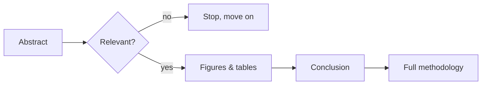

Yesterday's post covered the broader practice of staying current. This post drills into one specific skill within it — reading a research paper efficiently as a practicing engineer, whose goal differs from a researcher's goal of full technical mastery.



This deliberately front-loads the highest-information-density sections — most papers, read in this order, take 5-10 minutes to determine relevance, versus 45+ minutes reading linearly from introduction through methodology before knowing whether it was worth the time at all.

## The Engineer's Reading Goal Is Different From a Researcher's

A researcher needs to fully understand a paper's methodology to build on it or critique it. A practicing engineer usually needs a narrower answer: does this technique solve a problem I actually have, and roughly how would I apply it — a much faster read is appropriate and correct for that goal.

## The Abstract-Figures-Conclusion First Pass

```python
efficient_reading_order = {
    "1_abstract": "what problem, what claimed result — 30 seconds to decide if it's relevant at all",
    "2_figures_and_tables": "often convey the core result faster than prose — especially comparison tables",
    "3_conclusion": "what the authors themselves think matters most about their result",
    "4_only_then_the_methodology": "read in full only if the paper clears the relevance bar from steps 1-3",
}
```

This order deliberately front-loads the highest-information-density sections — most papers, read this way, take 5-10 minutes to determine relevance, versus 45+ minutes to read linearly from introduction through methodology before knowing whether it was worth the time at all.

## Questions to Answer for Any Paper You Deem Relevant

```python
practical_relevance_questions = {
    "what_specific_problem_does_this_solve": "and do I actually have that problem",
    "what_does_it_cost_to_apply": "compute, data, engineering complexity — the same cost-awareness from throughout this roadmap",
    "is_there_already_a_library_implementing_this": "often the practical answer is 'wait for someone to package it', not implement from the paper directly",
    "what_would_i_need_to_validate_before_trusting_it": "June's evaluation instinct, applied to a new technique's claims specifically",
}
```

## Being Skeptical of Benchmark Claims

```python
def evaluate_paper_benchmark_claims(paper: dict) -> str:
    if paper["benchmark"] == "a narrow academic benchmark" and paper["target_use_case"] != "your_actual_task":
        return "impressive benchmark numbers don't guarantee real-world transfer — validate on your own task before trusting"
    return "still validate — this is always true, benchmark match just changes your prior"
```

This directly extends October 30's benchmarking-methodology skepticism to research papers specifically — a technique's benchmark performance is a hint, not proof, that it'll help your specific problem, and the "measure on your own task" discipline from throughout this roadmap applies to adopting research findings just as much as it applies to comparing frameworks or vendors.

## Building a Lightweight Note-Taking Habit

```python
paper_note_template = {
    "one_line_summary": "the core claim in your own words",
    "relevance_to_my_work": "specific, not generic",
    "implementation_cost_estimate": "rough — is this a weekend experiment or a quarter-long investment",
    "follow_up_action": "try it / note for later / not relevant",
}
```

A lightweight, consistent note format — not exhaustive summaries — is what makes a paper's insight retrievable later without re-reading, directly feeding into tomorrow's personal-knowledge-base post.

## When Deep, Full Reading Is Actually Worth It

```python
deep_reading_triggers = {
    "directly_solves_an_active_blocker": "worth the full investment",
    "youre_about_to_implement_it_from_scratch": "need the methodology detail a summary can't provide",
    "its_becoming_foundational_to_the_field": "worth understanding deeply even without an immediate application, for the same reason this roadmap covered fundamentals",
}
```

The efficient skim-first approach isn't an argument against ever reading deeply — it's a filter that ensures the (genuinely valuable) deep reading time goes to the small fraction of papers that actually warrant it, rather than being spread thin across everything indiscriminately.

## Papers vs Practitioner Content: A Balanced Diet

For most practicing AI engineers, well-written practitioner blog posts and framework documentation (the kind of content this entire roadmap has modeled) provide faster, more directly applicable value than raw papers for the majority of day-to-day work — papers matter most for genuinely novel techniques not yet absorbed into practitioner-accessible tooling and writing.

---

*Part of the [Career series]({{ site.baseurl }}/tags/career-series/) — next: [building a personal knowledge base of AI techniques]({{ site.baseurl }}/posts/personal-knowledge-base-ai-techniques/), where this reading practice's notes actually go.*
