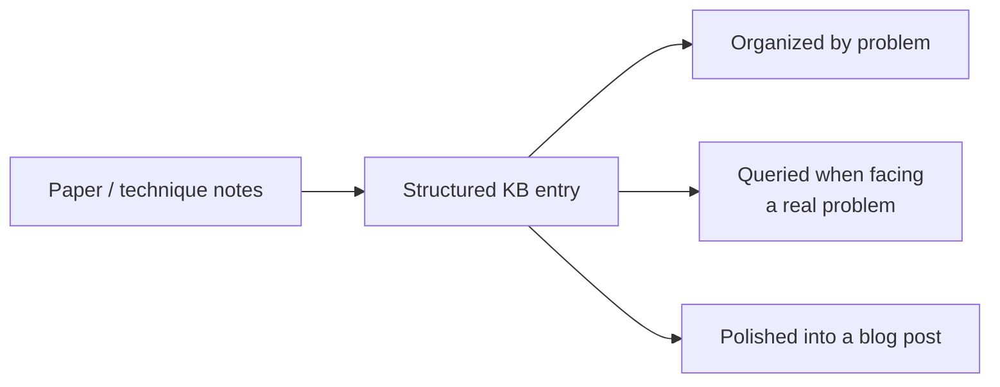

Yesterday's paper-reading notes need a home. This post covers building a genuinely useful personal knowledge base — applying October's knowledge-graph and RAG content reflexively to your own accumulated learning, not just to production systems.



A single entry feeds three different later uses — the structure below (organized by problem, not technique name) is what makes it actually retrievable at the moment you need it, rather than just a private, rarely-revisited archive.

## Why a Personal Knowledge Base Beats Scattered Notes

Notes scattered across bookmarks, browser tabs, and half-remembered blog posts are effectively unsearchable and rarely revisited — a structured, personal knowledge base turns nine months of this roadmap (and everything you learn afterward) into a genuinely queryable, reusable asset rather than a fading memory.

## A Practical Structure

```python
knowledge_base_entry = {
    "technique": "e.g. 'Semantic caching'",
    "when_to_use": "your own words, from real application, not copied definition",
    "when_not_to_use": "equally important — the judgment half",
    "code_snippet_or_reference": "a working example you've verified yourself",
    "source_links": "where you learned it, for deeper reference later",
    "personal_experience_notes": "'tried this on project X, worked well because...' — your own evidence",
}
```

The `personal_experience_notes` field is what distinguishes a genuinely useful knowledge base from a copy of documentation — your own applied experience with a technique is exactly the information that's hardest to reconstruct later and most valuable to have captured.

## Tools for Building This

```python
kb_tooling_options = {
    "simple_markdown_files": "in a git repo — searchable, versioned, no vendor lock-in",
    "a_note_taking_app_with_backlinks": "Obsidian, Notion — good for discovering connections between techniques",
    "your_own_rag_system": "build a small RAG chatbot over your own notes (directly Capstone 1's pattern, repurposed) — the most fitting tool given this roadmap's content",
}
```

Building a small personal RAG system over your own accumulated notes is a genuinely fitting capstone-style project — it's dogfooding March's core pattern on your own most valuable dataset: your own learning.

## Organizing by Problem, Not Just by Technique Name

```python
organization_by_problem = {
    "problem: reduce LLM API cost": ["semantic caching", "model routing", "prompt caching", "batch APIs"],
    "problem: agent keeps looping": ["loop detection", "budget guardrails", "reflection with bounded iterations"],
}
```

Organizing entries around the *problems* they solve, not just alphabetically by technique name, is what makes the knowledge base actually useful when you're facing a real problem later — you rarely start from "I want to look up semantic caching," you start from "requests are too expensive, what are my options," and the knowledge base should be structured to answer that query pattern.

## Keeping It Current as the Field Evolves

```python
def flag_stale_kb_entries(entries: list[dict]) -> list[dict]:
    return [e for e in entries if (now() - e["last_verified"]).days > 365]
```

Periodically revisiting older entries — confirming a technique or tool recommendation still holds, or updating it with what's changed — keeps the knowledge base trustworthy rather than accumulating quietly-outdated advice, the same documentation-staleness discipline from November's practices post applied to a personal rather than team asset.

## Sharing Selectively vs Keeping It Private

```python
sharing_decision = {
    "keep_private": "raw, unpolished working notes",
    "publish_selectively": "entries that, cleaned up, become blog posts (December 8's content) — the knowledge base as a content pipeline",
}
```

A well-maintained personal knowledge base is a natural source of blog post ideas — the entries that turn out to be genuinely useful and well-understood are exactly the ones worth polishing into the technical writing December 8 recommended, closing the loop between learning and building a public track record.

## The Compounding Value Over a Career

A knowledge base built consistently over years becomes a genuinely irreplaceable personal asset — faster problem-solving because you're querying your own prior experience rather than re-researching from scratch, and a rich source for interview preparation, technical writing, and mentoring others, which tomorrow's post covers directly.

---

*Part of the [Career series]({{ site.baseurl }}/tags/career-series/) — next: [mentoring others through the AI Engineer Roadmap]({{ site.baseurl }}/posts/mentoring-others-ai-engineer-roadmap/).*
