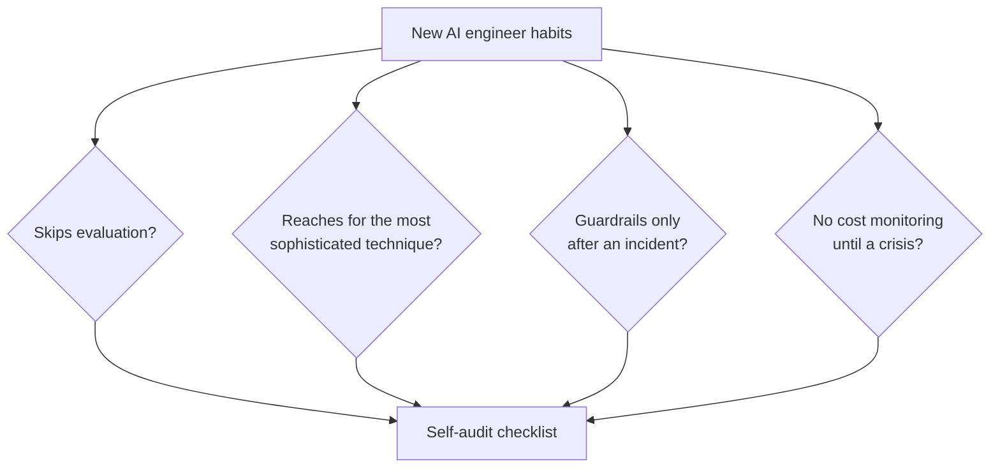

Yesterday's mentoring post referenced common sticking points. This post is the full, consolidated list — the mistakes that show up repeatedly enough across this entire roadmap's content that they deserve a dedicated, direct treatment.



These four are the highest-frequency mistakes across this whole roadmap's content, and the self-audit function later in this post turns the checklist into something you can actually run against a real project.

## Mistake 1: Skipping Evaluation Because "It Seems to Work"

```python
mistake_and_fix = {
    "mistake": "shipping based on a few manually-checked examples, no systematic evaluation",
    "fix": "June's entire series exists because of this exact mistake — build a golden set, even a small one, before calling anything done",
}
```

This is the single most repeated mistake across every post this month that mentioned it — the gap between "I tried it a few times and it looked right" and "I have a golden set and measured pass rate" is the single biggest quality differentiator this roadmap has emphasized since March.

## Mistake 2: Reaching for the Most Sophisticated Technique Available

```python
sophistication_trap = {
    "mistake": "using GraphRAG, multi-agent debate, or Tree of Thoughts for a problem a simple prompt would solve",
    "fix": "October 30's cost-benefit benchmarking discipline — always compare against the simpler baseline first",
}
```

Having learned sophisticated techniques throughout October especially, the temptation to use them because they're interesting is real — the judgment to recognize when *not* to use them is a harder, more valuable skill than knowing they exist.

## Mistake 3: Treating Prompts Like Disposable Strings

```python
prompt_discipline_mistake = {
    "mistake": "no versioning, no evaluation gate, no rationale documentation for prompt changes",
    "fix": "October 27's config versioning, June's CI regression gate, November 20's rationale-documentation practice",
}
```

## Mistake 4: No Guardrails Until After an Incident

```python
reactive_guardrails_mistake = {
    "mistake": "building guardrails only after something goes wrong in production",
    "fix": "March's guardrails principles are meant to be applied at design time, not retrofitted after an incident",
}
```

## Mistake 5: Ignoring Cost Until It's a Crisis

```python
cost_blindness_mistake = {
    "mistake": "no cost monitoring until a surprising bill arrives",
    "fix": "August/November's cost-attribution and monitoring practices, built in from the start",
}
```

## Mistake 6: Overreliance on the Model's Own Confidence

```python
overreliance_mistake = {
    "mistake": "trusting a model's stated confidence without independent verification",
    "fix": "June's calibration discipline — a model's self-reported confidence isn't automatically trustworthy",
}
```

## Mistake 7: Building for the Happy Path Only

```python
happy_path_mistake = {
    "mistake": "testing only clean, expected inputs — no adversarial or edge-case testing",
    "fix": "September's red-teaming and this roadmap's repeated emphasis on graceful failure handling",
}
```

## Mistake 8: Underestimating How Different AI Product Management Is

```python
product_mistake = {
    "mistake": "specs written as if the system were deterministic",
    "fix": "November 16's probabilistic-systems spec-writing framework",
}
```

## A Self-Check Against This List

```python
def self_audit_against_common_mistakes(project: dict) -> list[str]:
    mistakes_present = []
    if not project.get("has_golden_set"):
        mistakes_present.append("Mistake 1: no systematic evaluation")
    if not project.get("has_documented_prompt_versioning"):
        mistakes_present.append("Mistake 3: no prompt versioning")
    if not project.get("has_cost_tracking"):
        mistakes_present.append("Mistake 5: no cost monitoring")
    return mistakes_present
```

Running your own capstone projects (or real production work) against this checklist is a fast, concrete way to catch the most common gaps before they become the kind of costly lesson this list was compiled from.

## Why These Mistakes Are So Common Despite Being Well-Documented

Every one of these mistakes is easy to understand intellectually and easy to make in practice anyway — under real time pressure, the shortcut ("skip the golden set this once") always looks reasonable in the moment. The discipline this roadmap has tried to build isn't knowing these principles exist; it's the habit of applying them even when it's tempting not to, especially under deadline pressure.

---

*Part of the [Career series]({{ site.baseurl }}/tags/career-series/) — next: [the AI Engineer Roadmap: the year in review]({{ site.baseurl }}/posts/ai-engineer-roadmap-year-in-review/), beginning the roadmap's own retrospective.*
