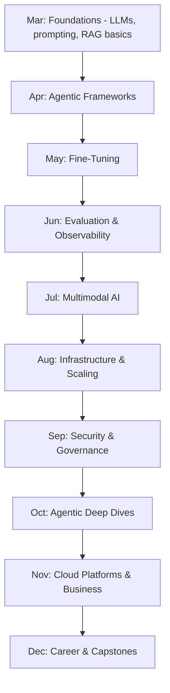

From the first post on March 1st through today, this roadmap has covered ten months of continuous, daily content. Before the final few posts close things out, this is a deliberate look back at the full arc — what was actually covered, and how it built on itself.

## The Full Arc



## The Throughlines That Ran Across Every Month

```python
recurring_principles = {
    "evaluation_first": "June's series, but referenced in nearly every subsequent post as the foundation everything else builds on",
    "visibly_wrong_beats_confidently_wrong": "from March's guardrails through December's product-management content",
    "guardrails_and_least_privilege": "March's foundation, deepened in September, applied throughout October's agent architectures",
    "cost_and_business_awareness": "threaded from June's cost-quality tradeoffs through November's full business framework",
    "measure_dont_assume": "October 30's explicit statement of a principle used implicitly since March",
}
```

Looking back, the specific techniques (which framework, which model, which cloud platform) are the part most likely to feel dated a year from now — these five principles are the part meant to remain true regardless of which specific tools are current when you're reading this.

## How the Months Built on Each Other

```python
month_dependencies = {
    "april_agents": "built directly on March's LLM fundamentals and RAG",
    "june_evaluation": "applied to every technique from March-May, and referenced by every month after",
    "september_security": "revisited nearly every agent and tool pattern from March-August through a risk lens",
    "october_deep_dives": "assumed April's framework fundamentals, went deeper",
    "november_business": "assumed the full technical foundation, added the organizational and financial layer",
    "december_career": "assumed genuine hands-on practice with the preceding content, via the capstones",
}
```

This wasn't ten independent topic dumps — each month assumed and built on what came before, which is why working through it in order (or at least understanding the dependency structure) matters more than treating any single month as a standalone reference.

## What a Reader Who Worked Through the Whole Thing Should Now Be Able to Do

```python
capability_checklist = {
    "design_a_production_rag_or_agent_system": "March, April, October",
    "build_a_real_evaluation_practice": "June",
    "reason_about_fine_tuning_vs_prompting_vs_rag": "May",
    "apply_security_and_governance_discipline": "September",
    "understand_the_infrastructure_and_cost_layer": "August, November",
    "communicate_and_advocate_for_good_practice_professionally": "December",
}
```

## What This Roadmap Deliberately Didn't Cover

Being honest about scope: this roadmap focused on AI *engineering* — building products with existing models — not the deeper ML research, model architecture, or training-from-scratch work that a dedicated ML/research track would cover (November 18's role-distinction post addressed this explicitly). That's a deliberate scope boundary, not an oversight.

## Revisiting Earlier Content With Current Eyes

If you're reading this having worked through the whole roadmap, going back to re-read March's early posts is worth doing — content that may have felt introductory in March likely reads differently now, with nine months of subsequent depth informing how you understand it.

---

*Part of the [Career series]({{ site.baseurl }}/tags/career-series/) — next: [where AI engineering is headed]({{ site.baseurl }}/posts/where-ai-engineering-headed-2027/), looking forward rather than back.*
