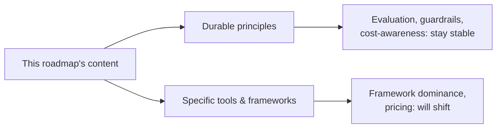

Yesterday looked back. This post looks forward, deliberately cautiously — predicting specifics in a fast-moving field is a losing game, but reasoning about trajectories from what this roadmap covered is more durable than guessing at headlines.



Splitting predictions this way is the reasoning framework this post argues for — betting on the left branch is what let this roadmap avoid betting its core content on any specific model generation remaining current.

## Trends Worth Watching, Reasoned From This Year's Content

```python
trajectory_observations = {
    "agent_autonomy_increasing": "October's deep dives suggest the field is moving toward more sophisticated multi-agent, longer-horizon systems — which raises the stakes on September's security content, not lowers them",
    "evaluation_tooling_maturing": "June's landscape of eval platforms will likely consolidate and standardize further, following the pattern any maturing infrastructure category follows",
    "regulatory_frameworks_solidifying": "September's EU AI Act coverage is early in that framework's implementation — expect more jurisdictions to follow with their own frameworks",
    "cost_per_capability_continuing_to_drop": "a consistent multi-year trend, which changes the fine-tuning-vs-prompting economics from May's series over time",
}
```

## Why Predicting Specific Model Capabilities Is a Losing Game

This roadmap has deliberately avoided betting its core content on any specific model's capabilities remaining current — the principles (evaluation, guardrails, cost-awareness) are built to outlast any specific model generation, which is exactly why they were the emphasis throughout rather than model-specific tricks.

## What's Likely to Stay Stable

```python
likely_stable_fundamentals = {
    "the_need_for_evaluation": "will not become less important as models improve — if anything, more important as stakes rise",
    "the_value_of_guardrails_and_least_privilege": "a permanent security principle, not a temporary workaround for current model limitations",
    "the_RAG_vs_fine_tuning_decision_framework": "the underlying tradeoff (facts vs behavior) is architectural, not model-specific",
}
```

## What's Likely to Change Significantly

```python
likely_to_shift = {
    "specific_framework_dominance": "April/October's framework landscape will likely look different — some frameworks consolidate, new ones emerge",
    "cost_structures": "November's pricing and cost-modeling numbers will need continual revisiting",
    "what_counts_as_a_hard_problem": "today's frontier techniques (Oct's Tree of Thoughts, debate) may become routine defaults as capability improves",
}
```

## Emerging Areas Worth Watching Beyond This Roadmap's Scope

```python
adjacent_emerging_areas = {
    "multi_agent_standardization": "A2A and similar protocols (October's coverage) are early — expect more standardization",
    "on_device_and_edge_capability_growth": "August's edge deployment post covers today's constraints, which will loosen over time",
    "regulatory_and_governance_maturation": "September's frameworks are early-stage industry practice, likely to formalize further",
}
```

## How to Position Yourself for an Uncertain Trajectory

```python
positioning_strategy = {
    "invest_in_durable_principles_over_specific_tools": "exactly this roadmap's own emphasis",
    "build_the_habit_of_evaluating_new_developments_against_your_actual_needs": "December 22's sustainable-learning practice",
    "maintain_genuine_hands_on_practice": "the capstone-project habit, continued indefinitely, not just for this roadmap's projects",
}
```

## A Deliberately Humble Closing Note

Anyone writing confidently about exactly what AI engineering will look like in a year is likely to be wrong about the specifics — the honest, useful thing this post can offer is a reasoning framework (durable principles vs specific tools) for evaluating whatever actually happens, rather than a prediction to be graded against reality later.

---

*Part of the [Career series]({{ site.baseurl }}/tags/career-series/) — next: [building your 2027 learning plan]({{ site.baseurl }}/posts/building-2027-learning-plan/), turning this forward-looking reasoning into a concrete personal plan.*
