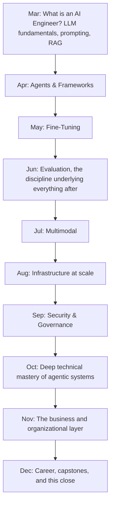

This is the final post — daily, from March 1st through today, December 31st. What began with a single question — "what is an AI Engineer, and how is it different from an ML Engineer" — closes here, with a full year of technical depth built on top of that first answer.

## The Complete Journey



## If You Worked Through This, What You Actually Built

Not just knowledge — concrete artifacts, if you followed December's capstone series: a production RAG chatbot with real evaluation, a multi-agent system, a published MCP server, a fine-tuned model with honest before/after comparison, an observability stack, and potentially a voice agent, a document pipeline, and a security-hardened coding assistant. That's a genuinely substantial portfolio, not just a reading list completed.

## The Principles Meant to Outlast Every Specific Technique

```python
what_should_stick_permanently = {
    "evaluate_before_trusting": "June's foundational habit",
    "visibly_uncertain_beats_confidently_wrong": "March's principle, referenced in nearly every month after",
    "guardrails_and_least_privilege_by_design": "not retrofitted after an incident",
    "cost_and_business_context_are_part_of_good_engineering": "not separate from it",
    "judgment_about_when_not_to_use_a_technique": "matters as much as knowing the technique itself",
}
```

If the specific frameworks, models, and cloud platforms covered throughout this roadmap look dated by the time you're reading this — and some likely will — these principles are what were actually meant to transfer forward regardless.

## This Roadmap Was Never Meant to Be a Finish Line

December 22 through 29 made this explicit: the field keeps moving, and a sustainable practice of continued learning (not a completed checklist) is the actual goal. Finishing this roadmap is a genuine milestone worth recognizing — and also, accurately, a beginning of an ongoing practice rather than an ending.

## A Direct Invitation to Keep Building

```python
next_steps = {
    "if_you_havent_started_the_capstones": "December 10-17 — start with whichever matches your current strongest interest",
    "if_youve_finished_some_capstones": "December 18-20 — review, deploy, and write them up properly",
    "if_youre_job_searching": "December 1-9's portfolio and interview content, backed by real capstone evidence",
    "if_youre_already_working_in_ai_engineering": "December 21-30's freelancing, mentoring, and continued-learning content",
}
```

## Thank You for Working Through This With Us

Every post this year assumed a reader genuinely trying to build real understanding, not just skim for buzzwords — that's the reader this roadmap was written for, and if that's been you, thank you for the sustained attention across ten months of daily content.

## What Comes After December 31st

The field doesn't pause for a calendar year to end, and neither should your practice — revisit December 29's learning plan, keep building, keep evaluating rigorously, keep writing about what you learn, and keep helping the next person starting where you started back in March.

---

*This concludes the [AI Engineer Roadmap]({{ site.baseurl }}/tags/roadmap/) — a full year of daily posts from March through December. Thank you for reading.*
